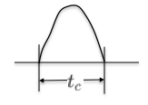
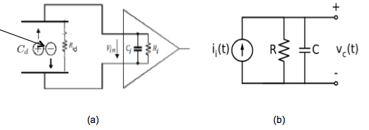
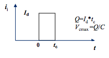
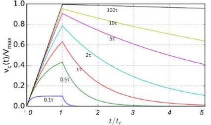
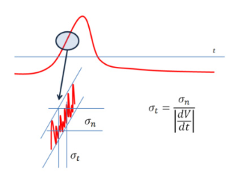

##2.1 粒子探测的基本方法
​	核探测器是利用核辐射产生的粒子在探测介质中引起的电离、激发等效应，测量辐射的类型、强度、能量和时间等相关信息的实验仪器。核探测器根据探测介质的不同分为气体探测器、闪烁体探测器、半导体探测器等类型；而根据探测粒子种类的不同，又可分为带电粒子探测器，中性粒子($\gamma$和中子等)探测器等类型。这些不同类型的核探测器工作原理都不尽相同，但遵从相同的基本原则：即粒子在探测器的灵敏体积内通过电离、激发等相互作用机制沉积的部分或全部能量，探测器将其转换成某种形式的输出信号。如带电粒子将能量直接转移给探测介质原子的核外电子使其电离，而中子或$\gamma$则经历两部过程：首先粒子与探测介质相互作用产生次级带电粒子，次级粒子再在介质中通过电离损失能量。根据探测器的工作原理的不同，沉积的能量可以转换成不同形式：气体探测器收集电离的电子和离子形成电流信号，而闪烁体探测器将能量损失转换成光信号。最终这些信号被后续的电子学进行处理：如放大、成型，进行模数(AD)转换。

### 2.1.1 探测器工作模式
​	核探测器工作模式可分为脉冲模式和电流模式。

​	在脉冲模式下，探测器响应单个入射粒子与探测介质的相互作用，在探测器收集电极形成电流脉冲(图 2-1-1)。

图 2-1-1 探测器电流脉冲波形

电流脉冲的持续时间$t_c$ 称为探测器的收集时间。探测器收集的总电荷量$Q$为电流脉冲$i_i(t)$在脉冲持续时间的积分，即：
$$Q=\int_0^{t_c} i_i(t) \text{ d}t     \quad   \tag{2-1-1}$$
电荷量$Q$与入射粒子在探测介质中沉积的能量$E$直接相关，对于大多数探测器而言$Q$与$E$呈正比关系。所有测量单个入射粒子信息的探测器必须工作在脉冲模式。当前绝大多数核探测器工作在脉冲模式。

​	在电流模式下，探测器记录在固定的响应时间$T$内的平均电流即，

$$I(t)=\frac{1}{T}\int_{t-T}^t i(t')dt'   \quad      \tag{2-1-2}$$

电流模式下探测器给出大量射线与探测器相互作用的平均效果。当每个粒子在探测器中生相同的电荷量时，电流的大小正比于单位时间内入射到探测器的粒子的数目，因此这种电流模式常用于测量辐射剂量的探测器。

###2.1.2 探测器信号的一般特征

​	下面我们以气体探测器为例，讨论探测器输出信号的一般特征。探测器可简化为两个金属极板间充入探测介质的平行板电容器，两个极板间施加有偏压，形成内部收集电场。当一个入射粒子进入探测介质内时与气体分子产生相互作用形成可自由移动的电子-正离子对。电子和正离子在收集电场作用下各自飘向正负极板，并在极板产生变化的感应电荷，最终在外部回路中形成电流脉冲。电流脉冲信号起始于电子-正离子对的产生的时刻，结束于电子和正离子到达各自对应极板的时间(详见  2.2 节)。
	探测器的等效电路如图2-1-2所示，设探测器具有内阻$R_{d}$和电容$C_{d}$，外部电路总电阻和电容分别为$R_i$和$C_i$（图 2-1-2.a）。探测器和外部电路可进一步等效为具有内阻$R$和电容$C$的脉冲电流源(图 2-1-2.b)，其中$R=R_{d}||R_i $, 通常探测器内阻$R_{d}\gg R_i$,因此$R\approx R_i$, 探测器等效电容$C=C_{d}||C_i=C_{d}+C_i$。探测器的输出信号取决于$i_i(t)$以及 $RC$的大小，其中 $\tau=RC$称为电路的时间常数。

​	图 2-1-2 探测器等效电路

电流脉冲的具体形状取决于电子和正离子在探测介质中的漂移速度和到达正负极板的时间。为了简化计算，假设探测器的电流脉冲为持续时间为$t_c$的矩形脉冲，平台电流值为$I_d$, (图2-1-3)。脉冲的总电量可写成 $Q=I_d\times t_c$，$Q$与入射粒子在探测器中的能量沉积成正比，最大输出电压为 $V_{max}=Q/C$。

​	图2-1-3 探测器矩形电流脉冲

 下面讨论输出脉冲$v_c(t)$ 的时间特性。$v_c(t)$ 的形状主要取决于时间常数 $\tau$与收集时间$t_c$的相对大小关系, 如图2-1- 4。

 1.  当 $\tau$ 远大于探测器的收集时间$(\tau>>t_c)$时，脉冲的上升时间主要取决于探测器的收集时间 $t_c$，电压脉冲的幅度在$t=t_c$时达到最大值 $V_{max}$，此时有 $V_ {max}\propto E$。 

 2.  而当 $\tau$远小于 $t_i$ $(\tau< < t_c)$时，输出脉冲幅度小于$V_{max}$，而$v_c(t)$形状与输入脉冲形状接近，即输出脉冲保留了输入脉冲的时间特征。

上述两种情况下$v_c(t)$的下降沿都以$\tau$为衰减常数按照指数规律下降。

​	上述脉冲形状与电路常数的关系对于探测器的应用有着重要的指导意义。对于能量型探测器，优先保证输出信号有足够大的幅度，而信号的时间特性并不是十分重要，此时探测器应满足$\tau>>t_c$条件；时间测量中输出脉冲应尽量保留快的上升时间，此时应满足 $\tau<t_c$。
例如，用于带电粒子能量测量的 Si 探测器的前放电路$RC$通常取100$\mu s$以上，而用于快时间测量的塑料闪烁体的光电倍增管的 $RC$通常取10 $ns$以下。  

​	图 2-1-4 探测器输出电压信号与电路常数$\tau$的关系。

### 2.1.3 脉冲高度谱和脉冲时间谱

​	探测器在脉冲模式下工作时，每探测到一个粒子就给出一个电压脉冲信号(图 2-1-5)。从上述讨论可知脉冲的幅度与粒子在探测器中的能量损失成正比，而脉冲信号上升沿幅度达到某一特定幅度$V_{th}$的时刻 $ t$ (即 $v(t)=V_{th}$) 与粒子入射到探测器的时刻 $ t'$有关, 通常这两者之间的时间差$t-t' =t_{delay}$ 是固定的。

​		图2-1-5 探测器脉冲信号的幅度和时间信息

对于多个入射粒子的能量和时间信息通常用直方图进行记录，直方图反映计数随着幅度/时间差的分布，其横轴对应幅度/时间差，纵轴对应每单位幅度/时间差内的累积计数(图 2-1-6)。记录幅度的直方图称为脉冲高度谱或能谱，记录时间信息的直方图称为脉冲时间谱或时间谱。

​		图 2-1-6. $NaI(Tl)$探测器测得的$^{60}Co$的$ \gamma$-射线的能谱。

###1.4 探测器的一般特性

#### 能量分辨率

​	能量分辨率是表征探测器分辨相近能量的本领，是探测器的最重要的性能指标之一。探测器的能量分辨率$\Delta E$ 通常定义为标准偏差$\sigma$，或者能量峰位半高处的全宽度(FWHM)，如图6 所示。对于高斯分布有 $\Delta E=2.35\sigma$。峰的宽度约窄能量分辨率越好。

​	能量峰的展宽的主要原因是电离产生离子对数目的涨落。带电粒子在探测器中产生一个离子对(电子-正离子或电子-空穴)所需的平均能量称为为平均电离能 $w$。平均电离能主要取决于探测介质的种类，而与入射粒子能量和种类关系不大, 这是核探测器测量射线能量的基本依据。几种典型的探测器的平均电离能见下表。

#### 表 1. 几种探测器的平均电离能
| 探测器种类  | 平均电离能($eV$) |
| ------ | ----------- |
| 半导体探测器 | ~ 3.6       |
| 气体探测器  | ~ 30        |
| 塑料闪烁体  | ~ 100       |

​	当入射粒子在探测器中沉积能量为$E$时，产生的初始电离数目的平均值为 $N=E/w$ , 探测器测得的能量 $E$ 与 $N$ 成正比。由于探测器中产生离子对的过程(激发、电离、倍增等)是随机的，因此即便每个入射粒子的能量沉积完全相同，产生的离子对的数目也有涨落，其数目围绕其平均值呈现一定的分布。探测器可探测的最小能量以及能量测量的精度皆受限于能量沉积产生的离子对数目的涨落。当$N$服从泊松分布时

$$\sigma_N=\sqrt{E/w}      \quad  \tag{2-1-3}$$

因此能量的标准偏差为$\sigma_E=w\sigma_N=\sqrt{Ew}$。

实验表明实际的涨落小于上式给出的值，即 $N$ 数目不完全服从泊松分布。引入法诺因子 $F$ 表征偏离泊松分布的程度, $\sigma_E$的可表示为

$$\sigma_E=\sqrt{FEw}       \quad  \tag{2-1-4}$$

其中 $0< F <1$, $F$的取值与探测介质有很强的依赖关系，几种典型探测介质的F取值见下表：

#### 表.2 几种探测介质的法诺因子
| 探测器种类   | F          |
| ------- | ---------- |
| Si,CdTe | 0.1 ~ 0.15 |
| 气体探测器   | 0.2 ~ 0.4  |
| 塑料闪烁体   | ~ 1        |

因此探测器的能量分辨率(FWHM)表为

$$\Delta E=2.35\sqrt{FEw}    \quad    \tag{2-1-5}$$

能量分辨率的另一个常用概念是相对能量分辨率$R$，定义成标准变差(FWHM)也测量平均値之比。

$$R=\frac{\Delta E}{E}=2.35\sqrt{\frac{Fw}{E}}    \quad  \tag{2-1-6}$$

在实际测量中除了前述的统计过程外，探测器的噪声、信号幅度的漂移等也会造成FWHM的展宽。当这些因素彼此独立无关时，总的FWHM可写成，

$$(FWHM)_{总}^2=(FWHM)_{统计}^2+(FWHM)_{噪声}^2+(FWHM)_{漂移}^2+ \text{ }…    \quad \tag{2-1-7}$$

以$^{60}Co$的能量为1.33MeV的$\gamma$射线的能谱测量为例，NaI(Tl)闪烁体探测器的相对能量分辨率约为6%(见图2-1-6)，而半导体Ge探测器的相对能量分辨率约为$0.15\%$。

#### 探测效率

​	常用的探测效率的定义有绝对探测效率和本征探测效率两种。绝对探测效率$ \varepsilon_{abs}$ 是指探测器记录到的粒子数与粒子源发射的粒子数之比。探测器本征探测效率$\varepsilon_{int}$，定义为探测器记录到的粒子数与入射到探测器灵敏体积的粒子数之比。本征探测效率与粒子与探测介质的相互作用截面大小相关(因此与粒子种类、能量相关)，也与探测器的厚度、探测阈值等相关。

​	引入几何接收效率 $\varepsilon_{geo}$, $\varepsilon_{geo}=\Omega/4\pi$, 其中$\Omega$为探测器对测粒子源所张的立体角，对于各项同性的粒子源绝对探测效率与本征探测效率的关系可写为$\varepsilon_{abs}=\varepsilon_{int} \cdot \varepsilon_{geo}$。

一般来说带电粒子探测器具有较高的探测效率，如Si探测器对 $\alpha$ 粒子的本征探测效率可达$100$%,  而中性粒子(如 $\gamma$,中子)与探测介质的相互作用截面很小，因此本征探测效率也很小。

#### 探测器的时间响应
从粒子进入探测器到形成一定幅度的输出信号需要特定的时间（见图 2-1-5），这个时间间隔称之为探测器的响应时间。探测器的响应时间与时间测量的精度有着密切的关系，好的时间探测器应该具有很短的响应时间，即很陡的信号上升沿。
假设探测器信号叠加在幅度涨落为$\sigma_{n}$的噪声上(如图4), 探测器的信号在幅度为$V_{T}$ 处的斜率为$\frac{dV}{dt}|_{V_{T}}$,　则由于$V_{T}$处的幅度涨落引起的定时点的不确定性可写为，

$$\sigma_{t}=\frac{\sigma_n}{\frac{dV}{dt}|_{V_{T}}}     \quad \tag{2-1-8}$$

由上式可见信号上升沿越陡(响应时间越短)，定时点受噪声幅度涨落的影响越小，时间测量的精度越高。

​					图 2-1-7. 探测器的响应时间

#### 死时间
​	探测器处理一个事件需要一定的时间，在这段时间探测器将不能记录其他事件，这段时间间隔称为死时间 (图8)。死时间与探测器形成输出信号时间与后续电子学的处理时间等因素相关。死时间会造成探测器的漏计数，导致实际测到的计数较实际的偏小。假设探测器的真实计数率为$n$, 死时间为$\tau$, 探测器实际计数率记为$m$。则单位时间内因死时间丢失的计数为$n\tau$， $n$ 可以表为

$$ n=m+n\tau \quad    \tag{2-1-9}$$
从而有，
$$ n=\frac{m}{1-\tau}   \quad  \tag{2-1-10}$$

​				图 2-1-8. 探测器的死时间

### 参考文献

[1]  William R. Leo, Techniques for Nuclear and Particle Physics Experiments, Springer-Verlag Berlin Heidelberg，1994.

[2] Glenn F. Knoll, Radiation Detection and Measurement, John Willey & Sons, Inc. , 2000.

