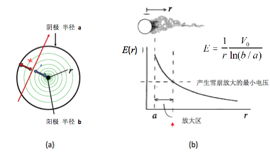

##2.2 核探测器

###2.2.1 气体探测器
气体探测器以气体作为探测介质，收集射线穿过气体时电离产生的离子对-电子和正离子获得核辐射的信息。相比于其他固体探测器，气体探测器的物质量小、对被探测射线的影响小，并且有着很好的时间响应和空间分辨。另外气体探测器具有灵敏区的大小和形状几乎不受限制，核辐射损伤小等突出特点，在环境监测、核物理和高能物理研究中有着广泛的应用。图2-2-1 为典型气体探测器的示意图，探测器由圆柱形金属容器和位于中心的金属阳极丝组成，容器内充以工作气体(通常为惰性气体，或以惰性气体为主的混合气体)，在阳极丝和金属圆筒(阴极)间施加正高压，在气体内部形成收集电场。当一个射线进入灵敏体积时，与工作气体分子产生作用使其电离或激发，在射线通过的轨迹上生成大量的离子对，在收集电场的作用下电子和正离子分别向阳极和阴极运动，在两极形成电流脉冲，最终在负载电阻中形成电压脉冲。

图 2-2-1 气体探测器的示意图

射线引起的电离过程包括原初电离和次级电离两部分的贡献。原始电离是指由射线与气体分子直接作用产生离子对的过程；而当原始电离产生的电子具有足够的能量时将再次电离气体分子，这个过程称之为次级电离。
气体探测器产生一个离子对所需的平均能量，即平均电离能$w$与气体种类有关，常用的气体的 $w$ 介于 $20$ 到 $40$ 之间，通常取$w=30$作为气体探测器的典型平均电离能取值；常用气体的法诺因子介于$0.2-0.4$。

在没有外加电场的情况下，电离产生的电子和正离子在运动过程中与周围气体分子产生频繁碰撞，最终电子和正离子复合形成中性原子。
当施加外部电场时，正粒子和电子分别沿电场的正方向和反方向做定向漂移运动。电子和正离子在漂移过程中被电场加速获得能量，同时又与路径上的气体分子产生频繁碰撞而损失能量，最终速度不再变化，这个平衡速度称之为漂移速度。漂移速度$v$与电场强度$E$和气体压强$p$的比值，即约化场强$E/p$成正比。
$$v=\mu \frac{E}{p}\quad   \tag{2-2-1}$$
比例系数 $\mu$ 称为迁移率，与气体性质有关。迁移率在相当宽的范围内与$E/P$无关 $（E/P < 3 \times 10^3 V . Cm^{-1} . atm^{-1})$ ，近似于常数。在典型的约化场强值 $E/p$~$1KV/atm$ 下电子和正离子的漂移速度分别为 $10^6 cm/s$ 和 $10^3 cm/s$，即电子的漂移速度比正离子大三个数量级。电子的漂移速度对气体成分很敏感，加入少量的多元至气体分子 (如$CO_2$和CH_4等) ，可显著提高电子漂移速度。

设带电粒子在气体探测器的有效气体空间形成$N_0$个离子对(初电离), 探测器最终收集的离子对数$N$和外加电压$V$的关系如图 2-2-2，图中划分为五个工作区域。

​	图 2-2-2 气体探测器收集的离子对数与电压的关系

**I. 复合区**：由于所加电压不高，电子和正离子在在漂移过程中由于复合损失，导致电荷收集不完全。

**II.电离区**。当外加电压足够高时，复合效应可以忽落不计，初总电离数$N_0$被全部收集，在一定电压变化范围内，收集到的电荷不随工作电压变化，达到饱和值$Q_0=N_0e$，它只与入射粒子的种类和能量有关。电离室工作在这个区域。

**III. 正比区**：随着电压升高，原始电离产生的电子在漂移过程中获得足够能量，产生次级电离，形成次级离子对。这个过程不断持续下去，最终使得收集的总离子对数$N$大于初始电离数$N_0$，即产生气体放大。$M=\frac{N}{N_0}$,称之为气体放大倍数, 在正比区$M$与射线的原始电离无关，只决定于工作电压，信号幅度与沉积能量成正比。 在正比气体放大倍数$M$可高达 $10^4-10^6$。多丝正比室等探测器工作在这个区域。
当电场增加到一定程度时由于空间电荷效应限制了气体放大倍数的增加，正比区的后一段区域成为有限正比区。

**IV. G-M区**：随着电压的增加，收集的离子对数目达到饱和，此时探测器输出信号幅度与入射粒子的种类和能量无关。探测器信号很大，不需要放大就可以直接用于记数。盖革-米勒计数器工作在这个区域，主要用于放射性剂量的检测。

**V. 连续放电区**：在该区随着电压增加，收集的离子对数再次急剧增加，气体被击穿，发生连续放电。

下面介绍脉冲电离室和正比室两种典型的气体探测器：

**脉冲电离室**

脉冲电离室是工作在电离区的气体探测器，典型结构有平板型和圆柱型。常用的工作气体有$Ar+10\%CO_2$ , $Ar+10\%CH_4$等。电离室主要用于低能带电粒子的能量测量。

​	图 2-2-3  平板型电离室

下面以平板型为例，讨论输出脉冲的形成过程( 图2-2-3 )。设探测器两极板间距为$d$,，射线在距负极板 $x$ 处水平入射, 负载电阻为$R$,电容为$C$。
设在$t=0$ 时刻， 距负极板 $x$ 处产生$N$个离子对。电子和正离子分别以$v_{-}$ 和 $v_{+}$的速度运动, 到达正极板和负极板的时间分别为$t_{-}$和 $t_{+}$。漂移过程中电子在正极板感应出正电荷，正离子在负极板感应出负电荷。电子和正离子在极板形成的感应电流脉冲分别为,

$$i_{-}(t)=\frac{Nev_{-}}{d} \quad   \tag{2-2-2}$$ 

 $$i_{+}(t)=\frac{Nev_{+}}{d} \quad   \tag{2-2-3}$$

总电流脉冲为两者之和。由于$v_{-}>>v_{+}$, 因此有$i_{-}>>i_{+}$。电子和正离子的引起的电流脉冲持续时间分别为 $t_{-}$ 和 $t_{+}$，并且有 $t_{-}<<t_{+}$ ，即当电子被正极板收集后，输出信号只有正离子漂移的贡献，如图2-2-4 所示。输出电压信号的具体形状取决于电流信号形状和回路的电路常数$RC$, 具体分析见上一节信号特征部分。

当 $RC>>t_{+}$时，对应的电子和正离子引起的电压脉冲分别为

$$V_{R-}(t)=\frac{Nev_{-}}{Cd}t_{-}   \quad \tag{2-2-4}$$  

$$V_{R+}(t)=\frac{Nev_{+}}{Cd}t_{+} \quad   \tag{2-2-5}$$

总电压脉冲为两者之和, 即 $V_R(t)=V_{R-}(t)+V_{R+}(t)​$。输出脉冲最大幅度为$V_{Rmax}=\frac{Ne}{C}​$, 与能量沉积成正比。典型的电离室的输出信号幅度的持续时间大于$1ms​$。对于$1 MeV​$的能量沉积,对应的输出信号幅度低于$1mV​$,需要进行进一步放大。

当 $t_{-}<<RC<<t_{+}$时，脉冲幅度主要由电子漂移贡献，输出脉冲幅度与电离产生的地点有关，不能用于射线能谱的测量，但可获得较高计数率。

 

 		图 2-2-4 电离室的 (a) 电流脉冲波形 (b) 电压脉冲波形

**正比计数器**

经典的正比计数器是由一根细丝装在直径约为1cm的管子中央构成的，阳极直径在十几到几十$\mu m$的范围。在细丝和管壁间加几千伏的高压，结构和电场分布如图2-2-5 所示。原始电离产生的电子在电场作用下向阳极漂移，当漂移到阳极丝附近时，电场急剧增加，在丝附近形成雪崩放大(正比区)。由于电子漂移速度远大于正离子漂移速度，电子很快被阳极收集，剩下的正离子团缓慢向阴极漂移。由于电子漂移的时间很短，电子对输出电压脉冲的贡献很小，雪崩产生的正离子贡献输出信号的主要幅度。通过选择不同的脉冲成型时间常数，可以获得不同的脉冲形状，满足不同需求。由于主要的电离都在丝附近产生，因此脉冲幅度几乎与原始电离的位置无关，因此既能用于粒子计数也能做能谱测量。正比计数器具有输出信号的幅度大，探测效率高的特点。在核物理和粒子物理实验中，由正比计数器发展衍生出的多丝正比室、漂移室等探测器在带电粒子的时间、位置等测量方面有着广泛的应用。

图 2-2-5 正比计数器

### 参考文献

[1]  William R. Leo, Techniques for Nuclear and Particle Physics Experiments, Springer-Verlag Berlin Heidelberg，1994.