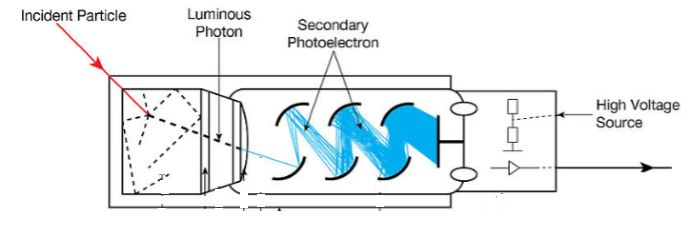
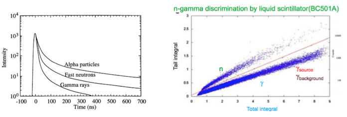
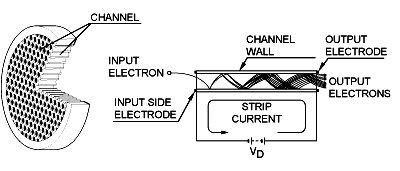

###2.3 闪烁体探测器
​	闪烁体是指能够将粒子在材料中损失的能量转换成闪光的一类材料。闪烁体探测器由闪烁体和光电转换器件组成，光电转换器件将光转换成电信号。闪烁体探测器有着非常多的优点，如$NaI(Tl)$, $LaBr_3(Tl)$等探测器对$\gamma$ 射线具有很高的能量分辨率和探测效率；塑料闪烁体、$BaF$ 探测器能够实现小于几十$ps$的时间分辨率；$CsI(Tl)$和液体塑料闪烁体可利用脉冲形状特性进行粒子种类的鉴别。现今闪烁探测器已成为适用性最强、用途最广泛的核辐射探测器之一，广泛应用于高能物理、核物理和核医学等各种领域。

#### 1. 闪烁体探测器

图 2-3-1是闪烁体探测器的示意图，闪烁体探测器由闪烁体、光收集部件和光电转换器件三个部分组成。粒子进入闪烁体后将其组成原子或分子电离或激发产生可见光波段的光，光子经闪烁体和外围反射材料传输最终入射到光电转换器件，光电转换期间通过光电效应将其转换成光电子，并将其放大最终形成输出信号。

​	图 2-3-1 闪烁体探测器示意图

#### 2.闪烁体的概述

​	闪烁体可分为有机闪烁体和无机闪烁体两大类，根据物质形态的不同可以为固体、液体或气体。

​	有机闪烁体可分为有机晶体闪烁体、液体闪烁体和塑料闪烁体三类。有机闪烁体含氢量很大，与快中子的相互作用截面高，可用于中子探测；另外其光衰减时间非常短(一般在$10ns$以内)，因此广泛用于高计数、快时间测量。

​	无机闪烁体大都是固体晶体，包括氧化晶体(如 $LiO_2$)、氟化晶体(如 $BaF_2$)或碘化晶体(如 $CsI, NaI$)等。这些晶体通常加入稀土或金属元素作为激活剂，以增加发光效率, 如$NaI(Tl), LaBr_3(Cs)$等。无机闪烁体密度比较大，对带电粒子和$\gamma$ 射线的阻止本领大，因此具有较高的探测效率。无机闪烁体还具有光输出产额高，能量线性好的特点，因此在高能带电粒子、$\gamma$ 谱学方面有着广泛的应用。

##### 有机闪烁体的发光机制

有机闪烁体主要是包含苯环结构的芳香族碳氢化合物，其发光过程主要通过苯环上碳的价电子中的$\pi$电子的跃迁实现。图 2-3-2 给出了有机闪烁体的能级结构和发光机制示意图。$\pi$电子的能级结构分成单重态和三重态，每种激发能级内都有一些精细能级，基态与第一激发态之间的间隔为$3-4 eV$，高能级间的能量间隔更小。带电粒子进入闪烁体使电子跃迁至单重态的激发态$S_1、S_2和S_3$，$S_2和S_3$态的电子通过无辐射跃迁的方式很快退激到$S_1$能级。处于$S_1$能级的电子通过下列三种方式退激：1）直接退激到$S_0$态的各能级，并发射光子，过程时间小于$1ns$, 发出的光称为荧光。2）电子以非辐射形式退激，辐射能转换成振动能。3）电子直接跳至三重态$T_1$, $T_1$至$S_0$的跃迁是禁戒的，因此电子在$T_1$滞留较长的时间后激发态退激(平均时间约为$0.1$s)。此时发出的光称为磷光，磷光强度弱于荧光。有机闪烁体中磷光过程发生几率很小，主要是荧光过程，因此有机闪烁体的衰减时间比无机闪烁体短很多。

​	图 2-3-2 有机闪烁体的能级结构和发光机制示意图

有机闪烁体内，从基态跃迁到激发态的能量大于退激发射光子的能量。因此有机闪烁体的发射光谱和吸收光谱有偏移，减少了光的自吸收，有利于光在闪烁体中的传播，如图2-3-3所示  。一般情况下，有机闪烁体的发射光谱和吸收光谱的偏移较小，两者之间仍有部分重叠。实际塑料闪烁体和液体闪烁体中加入移波剂，移波剂可在短波长处吸收光子，在长波长处发射光子，将荧光转换到可见光区，使其与光电转换元件的光谱匹配，同时将发射和吸收光谱的差异加大，进一步减少了光的自吸收。

​	图 2-3-3 有机闪烁体发射光谱与吸收光谱

##### 无机闪烁体的发光机制

不同无机闪烁体的发光机制有着较大的区别。下面主要介绍常用的掺杂无机晶体$NaI(Tl),CsI(Tl)$等晶体的发光机制。NaI晶体的能带结构如图2-3-4所示 。当晶体中的原子从入射粒子中得到足够能量而发生电离时，电离产生的电子就会从价带激发到导带，并在很短的时间内电子退激到价带，并发射光子。对于纯晶体，由于发射光子的能量较高，不在可见光范围，因此不易于探测。另外光子在晶体内传播过程中，可被其他原子所吸收，不易于传出。当在无机晶体中掺入少量的铊、钠、铯等元素作为激活剂后，则在禁带中形成局部能级，杂质的局部能级成为新的发光中心。当电离产生的电子经杂质能级退激时，发出的光在可见光的范围，因此传播过程中也避免了晶体的自吸收。

​	图 2-3-4 NaI(Tl)探测器的能带结构

无机闪烁体闪光也分为荧光和磷光两种退激过程。荧光过程中电子收到激发后迅速退激到基态并放出光子，时间在$10^{-7} s$ 以内，是闪烁光中的快成分。当激发态电子处于较长寿命的亚稳态时发出磷光，磷光的发光时间很长，通常大于$10^{-6} s$， 是闪烁光中的慢成分。无机闪烁体中掺杂适量的激活剂，可大大提高光产额，但会增大衰减时间。

#### 3.闪烁体的物理特性

 1）发射光谱

​	闪烁体的发射光谱是指闪烁体发射光子数随波长的关系曲线。闪烁体的发射光谱与闪烁体、激活剂、移波剂和温度等因素相关。闪烁体的发射光谱呈现为一个峰或多重峰的连续谱结构，最大峰处的波长称为最大发射波长。闪烁体使用时应注意发射光谱与选用光电转换器件的光谱响应是否匹配。无机闪烁体的发射光谱波段较宽，从紫外到黄光都有，而有机闪烁体集中在蓝光和绿光区域。

​	图 2-3-5 无机闪烁体的发光光谱 

2) 光产额

​	光产额$Y_{ph}$是指辐射在闪烁体中每沉积单位能量，所产生的闪烁光子数，可写成

$$Y_{ph}=\frac{n_{ph}}{E}  \tag{2-3-1}$$

​	单位为光子数/$MeV$。其中$n_{ph}$为产生的闪烁光子总数，$E$为辐射在闪烁体中损失的能量。很多晶体的光产额有温度依赖性。实验测量中光产额可以通过比较已知能量的全能峰的幅度与单光子峰的幅度得到。

3）发光衰减时间

​	闪烁体在吸收辐射后的 $t$ 时刻发射的光子数 $N(t)$ 遵从如下的规律，

$$N(t)=\frac{n_f}{\tau _f}e^{-\frac{t}{\tau _f}}+\frac{n_s}{\tau _s}e^{-\frac{t}{\tau _s}}  \tag{2-3-2}$$

$\tau _f, \tau _s$分别为快衰减时间常数和慢衰减时间常数；$n_f,n_s$ 分别为快衰减和慢衰减成分的总光子数。大多数无机晶体只有一种衰减成分，少数无机晶体和大多数有机晶体由快慢两种衰减成分。图2-3-6 给出了$BaF_2$闪烁体的发光时间分布，$\tau _f=0.9ns$, $\tau _s=630ns$。

图 2-3-6 $BaF_2$闪烁体的发光时间分布

#### 4.常用闪烁体

表 2-1 中列举出常用闪烁体的性能参数。

|              | 密度$g/cm^3$ | 最大发射波长/$nm$ | 光产额 /$MeV$ | 衰减时间常数/$ns$ | 相对脉冲高度/能量分辨率@667keV $\gamma$  # | 潮解性 |
| :----------: | :----------: | :---------------: | :-----------: | :---------------: | :----------------------------------------: | :----: |
|  $NaI(Tl)$   |     3.67     |        410        |     38000     |        230        |                1.00 / 7.4%                 | 易潮解 |
|  $CsI(Tl)$   |     4.51     |        540        |     65000     |     680, 3340     |                0.49 / 7.9%                 | 微潮解 |
|    $CsI$     |     4.51     |        315        |     2300      |        16         |                0.05 / 25.1%                | 微潮解 |
|    $BGO$     |     7.13     |        480        |     8200      |        300        |                0.13 / 10.8%                |   无   |
|   $BaF_2$    |     4.9      |      220/310      |   1400/9500   |     0.8 , 630     |                0.2 / 13.9%                 |   无   |
| $LaBr_3(Ce)$ |     5.29     |        350        |    490000     |        20         |                 na / 3.7%                  | 易潮解 |
|  塑料闪烁体  |     1.03     |        423        |     10000     |         2         |                  0.25 / -                  |   无   |
|  液体闪烁体  |     1.03     |        423        |     10000     |       2200        |                  0.25 / -                  |   无   |

$\#.$ 用双碱阴极光电倍增管Hamamatsu R1306 读出, na : 无数据，- : 无全能峰

##### 1.  $NaI(Tl)$晶体

​	NaI(Tl)晶体光产额高，密度大，对$\gamma$ 射线具有很高的探测效率。发光光谱与常见的双碱阴极光电倍增管匹配。有较好的能量分辨率，是探测$\gamma$ 射线的主要探测器。缺点是衰减时间长，易潮解，需要封装使用。

##### 2.  $CsI(Tl)$晶体

​	CsI(Tl) 晶体光产额高，密度大，不易潮解，容易加工成不同的形状，发光衰减时间长。$CsI(Tl)$的快慢成分的比例与粒子种类有关，因此可用作粒子鉴别。$CsI(Tl)$探测器通常用于$\gamma$射线和高能带电粒子的测量。

##### 3.  $BGO$晶体

​	BGO 晶体(分子式 $Bi_4Ge_3O_{12}$), 密度大，能量分辨率较差(发光产额为$NaI$的$8-20\%$左右)，但对$\gamma$射线的探测效率高，容易加工成不同的形状。$BGO$晶体在高能物理和核医学成像方面有着重要应用。

##### 4.  $BaF_2$晶体

​	BaF2 晶体, 密度大，有非常快的时间响应，是目前已知唯一的快衰减时间小于1ns的的高密度闪烁体。快成分光产额的温度依赖性非常小，而慢成分的比例随着温度增加很快减少。发光产额为$NaI$的$20\%$左右，发光光谱在紫外波段，需要专门的光电倍增管配合。$BaF_2$晶体在$\gamma$ 的快时间测量方面有着重要的应用。

##### 5.  $LaBr_3(Ce)$晶体

​	LaBr3晶体是年近来发展的新型无机闪烁体，具有光产额高，时间响应快，能量分辨率高的突出特点。光输出对温度不敏感，有非常好的能量线性。主要的缺点是材料存在内部$\alpha$ 放射性，在使用中需要注意。

##### 6.  塑料闪烁体

​	塑料闪烁体的含氢量高，发光时间很短，光传输性能优良，容易加工成不同的形状。塑料闪烁体造价便宜，可以做成很大的尺寸。塑料闪烁体在快中子探测，带电粒子的快时间测量上有着广泛的应用。

##### 6.  液体闪烁体

​	液体闪烁体的发光的快慢两种成分的相对比例随入射粒子的种类而变化，可利用这一特性进行中子-$\gamma$鉴别(图 2-3-7)。广泛应用于$\gamma$本底环境下的中子测量。

 

​	图 2-3-7 液体闪烁体$n-\gamma$甄别

#### 5.光的收集

闪烁体的光收集部分，负责将闪烁体内部不同位置产生的光子均匀传输到光电器件上，并使得光在传输过程中损失最小。影响光收集的主要部分是光传输过程中光学性质产生突变的界面，包括闪烁体的反射层，耦合剂和光导等。

1.反射层

​	反射分为镜面反射和漫反射。镜面反射下入射光和反射光遵从反射定理，镜面反射材料可以用铝箔或镀铝塑料薄膜。而漫反射的出射光的反射角与入射光的角度无关，出射光的角分布遵从$Lambert$ 定理(图 2-3-8 )，即

$$\frac{dI}{d\theta} \approx cos \theta   \tag{2-3-3}$$

其中$I$为反射光的强度，$\theta$ 为出射光的反射角。

​		图 2-3-8 光的漫反射

最常用的漫反射材料有：$MgO$、$TiO_2$和$Al_2O_3$ 的粉末或聚四氟乙烯带，这些材料的反射率与波长相关，$TiO_2$和$Al_2O_3$ 分别在波长小于$400nm$和$280nm$时，反射率降低30%以上。一般来说，漫反射材料的光收集效率优于镜面反射材料，主要原因是漫反射可以改善闪烁体光的镜面反射存在"死角"的问题，即光在闪烁体表面经多次反射后损失，无法传到光电器件的入射窗。漫反射还有助于改善探测器的各部分的效率的不均匀情况。在一些情况下，镜面反射材料的时间性能优于漫反射材料，镜面反射材料通常用在快时间探测器或需要薄反射层的探测器的反射层上。

2.光学耦合剂

​	当光从折射率为$n_0$的闪烁体射向折射率为$n$的外部物质时，如果有$n_0>n$时，则可产生全反射，全反射的临界角为$\theta_c=sin^{-1}\frac{n}{n_0}$。为减少全反射引起的损失，应增大临界角，即应避免折射率剧烈变化。光从闪烁体经空气层到达光电器件的入射窗时，在闪烁体和空气($n=1$)界面处产生全反射损失。为了减少全反射损失，闪烁体和光电器件之间加上一层光学耦合剂($n\approx 1.5$)，如图2-3-9所示。常用光学耦合剂有甲基硅油或硅脂，加入光学耦合剂可使输出光幅度比不加时增加$1/3-1$倍。

​	图.2-3-9 闪烁体与光电转换器件之间的耦合

3.光导

​	当闪烁体的出射面和光电器件无法直接接在一起时，如存在空间限制、存在磁场(磁场对光电倍增管有影响，见2.3.6节)或两者的形状不匹配时需要使用光导作为过渡，将尽可能多的光从闪烁体传输到光电器件。刘维定理给出了光导光传输率的极限，即最大的光传输率等于光导输入端和输出端的截面面积之比。

$$\frac{I_{out}}{I_{in}} \leq\frac{A_{out}}{A_{in}}  \quad \quad  \quad       (A_{out}\leq A_{in})  \tag{2-3-4}$$

其中$I_{in} 和 I_{out}$为光导输入端和输出端光强，$A_{in} 和 A_{out}$为光导输入端和输出端的截面面积。根据2-3-4式，为使光传输率最大，光导不同位置的截面面积应保持不变(至少截面面积不应变小)，形状避免剧烈变化。光导光导的常用材料是PMMA(有机玻璃)，表面抛光，用镜面反射材料包裹。鱼尾型光导常用于方形截面到圆形截面的过渡，如图 2-3-10。

图 2-3-10 鱼尾型光导

#### 6. 光电转换器件

​	光电转换器件是利用光电效应将光信号转换成电信号的器件。光电转换器件已经形成种类众多的大家族，在光学和核探测等领域有着广泛的应用。下面主要介绍闪烁体探测器常用的光电倍增管，微通道板和光二极管。

#### 1.光电倍增管

​	光电倍增管的示意图如图2-3-11所示，光电倍增管的内部抽成真空，用玻璃外壳进行封装。光电倍增管包含光阴极(K)、打拿级($D_i$)、阳极(A)以及分压器(Voltage divider)。

​	从闪烁体出射的光子经光电倍增管的入射窗打在光阴极产生光电子，光电子在电极间电场加速后的能量打到倍增电极(第一打拿极)上，产生二次电子发射，随后经后面多个打拿级的倍增，倍增的电子流最终被阳极收集，形成阳极电流。光电倍增管具有极高的灵敏度和极低的噪声，光电倍增管还有快速响应、低本底、大面积阴极等特点。

​	图2-3-11 光电倍增管示意图

1.入射窗

常用的窗材料有硼硅玻璃、透紫玻璃(UV玻璃)、合成石英和$MgF_2$。 不同材料的透射率与波长有依赖关系。硼硅玻璃可以透过低至$300nm$的入射光，但不适合于紫外探测。透紫玻璃(UV玻璃)、合成石英和$MgF_2$可将透射率向短波长方向分别延伸至$185nm、160nm 和 115nm$。

 2.光阴极

​	光阴极一般是具有低逸出功的碱金属材料形成的光发射面，通过光电效应将入射光子转换成光电子。在核探测用光电倍增管中常见的光阴极是双碱材料。双碱材料光阴极具有与$NaI(Tl)$晶体匹配的良好的光谱响应特性。

3.打拿级

​	常用的打拿级材料有$BeO、MgO、Cs_3Sb$等。光阴极发出的光电子加速后打到第一个打拿级时，打拿级将一个入射电子的能量传递给多个电子，产生多于入射光电子数目的电子流(二次电子发射效应)，由此产生电子的倍增，这些二次电子发射的电子流又加速到下一个打拿级产生倍增，最终被阳极收集。

光电倍增管按倍增极的结构进行分类可分成百叶窗式、盒栅式、环形聚焦型和直线聚焦型，如图 2-3-12。

​	图 2-3-12 光电倍增管倍增极结构

不同倍增极类型的特点总结在表 2-2 中。核探测器中常用的是直线聚焦性。

表 2-2 不同倍增极类型的光电本征管的特点

| 倍增极类型 | 特点                                       |
| :---: | :--------------------------------------- |
| 百叶窗式  | 百叶窗型结构的倍增极可以较大，能够应用于大阴极的光电倍增管中。多应用于对时间响应要求不高的场合。 |
|  盒栅式  | 收集效率高，结构紧凑，时间响应不高。                       |
| 环形聚焦型 | 结构紧凑，时间响应快。                              |
| 直线聚焦型 | 具有很好的能量线性和极快的时间响应。被广泛应用于对时间分辨率和线性脉冲要求较高的研究领域。 |

打拿级的二次电子发射系数与打拿级的材料有关，也与打拿级和前一极的电势差$V_d$有关。在$V$不是很大时有 $\delta \propto V_d$。

4.阳极

​	阳极材料一般用镍、钼、铌等材料制成。

5.分压器

​	光电倍增管的各电极电位由外加电阻分压器提供(图 2-3-13)，分压器将一个总高压(称为光电倍增管的工作高压)通过一系列不同阻值的电阻分配到不同的电极，阳极串接电阻$R_L$作为负载，$R_L$两端电压正比于阳极电流。高压的供电方式分成正高压和负高压两种方式。正高压方式，在阳极加正高压，将阴极接地，此时输出端必须用耐高压隔直电容将高压隔离，不适合于电流模式和高计数率的情况。负高压方式将阳极接地，阴极加负高压，适合于电流和高计数率模式。但此时阴极处于高电位，需注意与周围接地材料的绝缘。

​	光电倍增管的打拿级之间的光电子流在分压电阻上形成与高压电源的供电电流方向相反的回馈电流(参见图.2-3-11)。由于最后几个打拿级之间光电子电流变得很大，回馈电流会显著降低打拿级之间的压差，导致光电倍增管的增益随着入射光强度的增加而降低。常见的解决方法是在最后几个打拿级之间加入脱耦电容，脱耦电容在电流脉冲持续期间提供电荷，防止电压的变化。光电倍增管的能量和时间特性与各级所加电压有密切的关系，各级分压电阻的大小需要进行仔细调节。光电电倍增管的生产厂家通常提供适合于不同应用的分压电阻和电容的推荐值，或提供现成的分压器产品。

​		图 2-3-13 光电倍增管的分压器

##### 光谱响应

​	光电倍增管的光阴极将入射光的能量转换为光电子，其转换效率(光阴极灵敏度)随着入射光的波长的不同而改变。这种光阴极灵敏度与入射光波长之间的关系成为光谱响应特性。光谱响应通常以不同波长下的辐射灵敏度和量子效率来表示。辐射灵敏度S为某一波长下的光阴极发射出的光电子电流与该波长的入射光能量之比，单位为$A/W$。量子效率$QE$为光阴极发射的光电子数与入射光子数的比值，一般用百分比来表示。图 2-3-14 给出了双碱基光电倍增管的典型光谱响应曲线。常用的双碱基光阴极在最大光照灵敏区对应处量子效率为$20\%$左右，意味着平均$10$个入射光子可产生2个光电子。

​		图 2-3-14 光电倍增管的光谱响应曲线

光谱响应特性同时取决于光阴极和入射窗材料，一般来说光谱响应特性的长波端取决于光阴极材料，而短波端取决于入射窗材料。光电倍增管的光谱响应特性要与闪射体的发射光谱相匹配。

##### 放大倍数

假设光电倍增管共有$n$个打拿级，每一个打拿级的二次电子发射系数为$\delta$, 则光电倍增管的电流放大倍数或增益$M$可写成，

$$M=（\alpha  \delta)^n  	 \tag{2-3-5}$$

其中$\alpha$为各打拿级的电子收集效率。 

由于$\delta \propto V_d$，有$M \propto V^n$，从而有$logM \propto logV$ 的关系。增益取对数值与高压取对数值之间满足线性关系，这一关系常被用与估计不同工作高压下光电倍增管的增益的变化趋势。一般光电倍增管有$9-12$个打拿级，工作高压的微小变化可引起很大的增益变化，一般要求高压电源的高压输出稳定性好于$0.05\%$。

当电压升高到一定值后，光电倍增管即产生自发放电，这种自发放电会使光电元件受到损坏。因此工作时不能超过光电倍增管允许的最高电压。

##### 时间特性

光电倍倍增管对入射到光阴极的短脉冲光的时间响应如图2-3-15所示。

入射光入射到光阴极的时刻到阳极电流输出最大值所经历的时间定义为渡越时间。由于不同电子的初速度和所经历的电场以及路程各不相同，对于不同的光脉冲输入，渡越时间每次略有不同，这种渡越时间的涨落称为渡越时间分散，定义为单光子入射时时间谱的半高宽($FWHM$)。渡越时间分散越小，时间性能越好。时间响应特性取决于倍增极的结构和工作电压。通常直线聚焦型和环形聚焦型倍增极结构的光电倍增管比盒栅式和百叶窗型有更好的时间特性。直线聚焦性的渡越时间为几十$ns$，渡越时间分散在$1-3ns$的范围内。

​		图 2-3-15 光电倍增管的短脉冲光时间响应

**阳极暗电流**

光电倍增管在完全黑暗的环境中仍会有微小的电流输出, 这个微小的电流叫做阳极暗电流。

阳极暗电流是决定光电倍增管对微弱光信号的检出能力的重要因素。

##### 磁场影响

大多数光电倍增管会受到磁场的影响，磁场会使光电倍增管中的发射电子脱离预定轨道而造成增益损失。通常在光电倍增管外部裹上磁屏蔽套筒(坡莫合金)来减小光电倍增管所处环境的磁场强度。

##### 温度特性

工作环境的温度变化影响光电流的强度，光电倍增管必须在温度波动不大的环境中工作。在实际使用过程中光电倍增管在加工作电压后需要等待一个小时或更长时间以使其温度达到稳定。

**疲劳和老化**

入射光强度较大或照射时间较长，会引起光电流的衰减。如果入射光较强，产生超过1 mA的光电流，光电倍增管就可能因老化而损坏。应严格避免在未遮光或强光环境下加工作电压。

#### 2.其他光敏器件

1. 微通道板（MCP)

MCP是上百万的微小玻璃管（通道）彼此平行地集成为薄形盘片状而形成(图2-3-16)，每个通道内壁涂有二次电子发射系数较大的材料，MCP的两个端面之间施加直流电压形成电场。每个通道都是一个独立的电子倍增器，入射到通道内的电子在电场的作用下与内壁碰撞产生二次电子。这些二次电子在电场下得到加速，碰到内壁产生更多的二次电子，实现连续倍增。MCP具有比任何其他分离电极倍增极结构更快的时间响应，并且当采用多阳极输出结构时，在磁场中仍具有良好的一致性和二维探测能力。

图 2-3-16 微通道板

2. 硅光二极管（Si Photo-Diode）

光电二极管(图 2-3-17)是由一个PN结组成的半导体器件，在反向电压作用之下工作。当有可见光入射时，光子的能量被吸收产生电子和空穴对，电子和空穴被内部电场收集产生光电流。硅光二极管有着很高的量子效率(在$700nm$波长区域高达80%)。相比于光电倍增管，硅光二极管具有体积小、操作简便的突出特点，因此硅光二极管和无机闪烁体的组合被广泛用于带电粒子和$\gamma$射线的探测中。硅光二极管没有内部放大，因此输出信号很小，需要配合前置放大器使用。

​	图 2-3-17 光电倍增管的短脉冲光时间响应

[1]  William R. Leo, Techniques for Nuclear and Particle Physics Experiments, Springer-Verlag Berlin Heidelberg，1994.

[2] Glenn F. Knoll, Radiation Detection and Measurement, John Willey & Sons, Inc. , 2000.

[3] http://www.hamamatsu.com/eu/en/community/optical_sensors/articles/photomultiplier_tube_handbook/index.html

