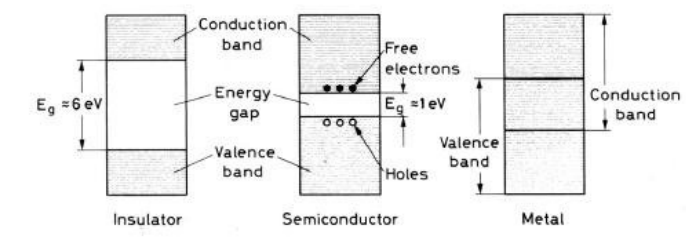
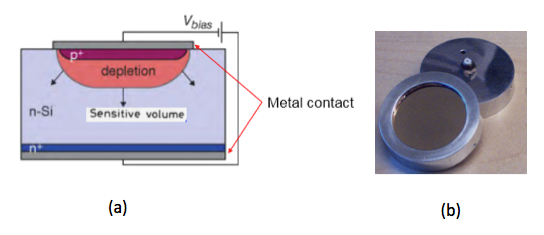
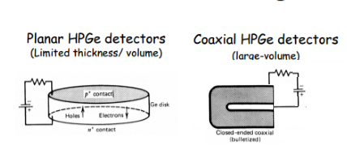
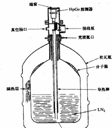

###2.4 半导体探测器
半导体探测器是以半导体材料为探测介质的核探测器。半导体探测器具有很高的能量分辨率，分辨率比气体探测器大约高一个量级，也大大优于闪烁体探测器。除此之外，半导体探测器还具有很宽的能量响应线性范围，时间响应快(ns量级)、体积小等优点，在带电粒子能量和位置测量、$\gamma$ 射线、$X$ 射线的测量方面有着广泛的应用。半导体探测器的也称为“固体电离室”，其工作原理与气体电离室十分类似，对应的电荷载流子是电子-空穴对。

####1. 半导体的基本性质

根据物质的导电能力，物质可分为导体、绝缘体和半导体。导体的电阻率在$10^{-5}\Omega \cdot cm$以下，绝缘体的电阻率在$10^{14}\Omega \cdot cm$以上，半导体的电阻率介于导体和绝缘体之间，一般在$10^{-2}-10^{9}\Omega \cdot cm$之间。导体、半导体和绝缘体性质的主要区别可以用固体能带理论进行解释，如图2-4-1。半导体和绝缘体、导体之间差别在于能隙大小的不同。导体不存在禁带，大量电子处于导带，能自由移动，在外电场下形成电流，因此导电性能最好；绝缘体的能隙最大($E_g=5-10eV$)，常温下光照或热激发能量不足以使电子从价带跃迁到导带，因此导电性能最差。半导体的能隙介于两者之间($E_g=0.1-2.2eV$)，有少部分电子可被激发到导带，在外电场下形成电流。同时价带中留下的空位(成为空穴)也参与导电，这是因为价带内的空穴很容易被临近原子的电子占据，因此效果上形成空穴的移动。空穴带有正电荷，在外电场下移动方向与电子相反，这两者的组合称之为电子-空穴对，半导体中的电荷载流子是电子-空穴对。常用的半导体材料有硅和锗，在室温下，本征硅的电子和空穴载流子浓度相同，为$N_n=N_p=1.5 \times 10^{10}/cm^{3}$; 对应的本征锗的载流子浓度为$N_n=N_p=2.4 \times 10^{13}/cm^{3}$。硅和锗的平均电离能$w$约为$3eV$; 硅的法诺因子$F$为 $0.1$、锗约为 $0.06$。

图 2-4-1 绝缘体、半导体和导体的能带结构示意图

在半导体内部，电场不是很强时，电子和空穴的漂移速度$v_e$ 和 $v_h$正比于外加电场$E$，即 $v_e=\mu_e E $ 和 $v_h=\mu_h E $。$\mu_e$ 和$\mu_h$分别称为电子迁移率和空穴迁移率，迁移率与半导体材料特性以及温度相关。气体探测器中电子的迁移率远大于正离子，而半导体中电子和空穴的迁移率相差不多，在常温下，电子的迁移率为空穴的$2-3$倍左右。
当电场逐渐增加时，漂移速度随电场增加而增加缓慢，并最后达到饱和。半导体探测器通常都工作在非常高的电场条件下，以得到电荷载流子饱和速度。对于$100\mu m的$半导体材料，在饱和速度下载流子的收集时间约为$10ns$，因此半导体探测器具有非常快的时间响应。

尽管本征半导体具有上述优良特性，但仍不能用作核探测器。核探测器应满足下述条件：即绝大多数电荷载流子应是由外部进入的粒子引起的，当没有粒子进入时，探测介质内的载流子应尽可能少。另外，内部收集电场应足够强，以有效收集电荷载流子。下面我们考察一厚度为$1mm$，面积为$1cm^2$，施加$300V$的工作电压的本征硅半导体。在室温条件下，热激发产生大小为$10 mA$ 的直流本底电流$I_{leak}$。而对于入射粒子产生的$300 keV$ 能量沉积，探测器仅产生不到 $I_{pulse}=1 \mu A$ 的电流脉冲。因此以本征半导体作为工作介质的探测器不满足上述条件。为了满足$I_{pulse} \gg I_{leak}$ 的条件，应大大抑制直流本底电流或提高探测介质的电阻率。将$P$型半导体和$N$型半导体相接形成$PN$ 结，并在$pn$结加上反向偏压形成的探测器灵敏区，满足上述条件。

####2. PN结

下面以晶体硅为例，来n型和p型半导体。四价硅单晶中掺入少量的五价元素磷(其他掺杂五价元素有锂、砷等）时，磷原子替换常规硅原子，占据晶格中的一个位置。磷原子和相邻四个硅原子形成共价键，剩余第五个价电子和磷原子结合不很紧密，只要很小的能量(小于$0.05eV$)就可以激发电离，从而成为自由电子参与导电，这种把电子贡献给导带的杂质称为施主杂质。这种半导体的导电主要是由电子贡献的，因此叫电子型或n型半导体,如图2-4-2所示。p型半导体中掺入三价元素如硼、铝、镓，三价元素与周围的四个硅原子只能形成三个共价键，有一个共价键是不饱和的，因此具有从附近硅原子捕获一个电子形成饱和建的趋势，能接受价带中电子而产生空穴的杂质称为受主杂质。这种半导体的导电主要是用空穴贡献的，因此叫空穴型或p型半导体，如图所示。$n$型半导体和$p$型半导体的的主要载流子分别为是电子和空穴，n、p半导体中所能提供的载流子的浓度大大高于本征半导体的载流子浓度。

图 2-4-2 n型半导体和p型半导体

当$p$型半导体和$n$型半导体相连接时，由于主要载流子的浓度差异，电子将从$n$区向$p$区扩散，与空穴复合；而空穴则从$p$区向$n$区扩散与电子复合, 扩散结果形成$pn$结。在$pn$结区，剩下的杂质正负离子形成空间电荷区，阻止电子和空穴进一步扩散，最终电子和空穴的浓度不再变化。$pn$结区载流子密度很低，电阻率可达$10^{10}\Omega \cdot cm$, $pn$结通常也称为耗尽层。$pn$结的电荷分布和内部自建电场分布如图2-4-3.a所示。

图 2-4-3. $pn$结的电荷分布和内部电场分布。 (a)未施加外部电压，(b)施加反向电压

此时pn结之间生成的耗尽层厚度仅有几十微米，而且内部电场强度很小。当在$pn$结两端加上反向偏压时，反向电压形成的电场与内部自建电场方向一致，内部电场得到加强，耗尽层厚度变大。
实际上，通常半导体$pn$结的p区和n区的掺杂浓度差别很悬殊。当n区掺杂浓度远高于p区，即$N_n \gg N_p$时称为$n^{+}p$型，反之则称为$p^{+}n$型。假设半导体为$n^{+}p$型，$n$区和$p$区耗尽层的宽度分别为$d_n$和$d_p$。由于结区总电荷为零，因此有$N_nd_n=N_pd_p$, 又因 $N_n \gg N_p$，所以有$d_p \gg d_n$,即耗尽层的宽度主要由掺杂少的一侧的杂质的浓度决定。当$pn$结两端反向偏压为$V$，掺杂少的一侧杂质浓度为$N_D$时耗尽层的宽度$d$可用下式描述，

$$d=\lgroup \frac{\varepsilon V }{2\pi eN_D} \rgroup ^{1/2}  \tag{2.4.1}$$

当反向偏压足够大的时候，耗尽层扩展到整个探测器，称为全耗尽。

####3. 半导体探测器的特性

1. 耗尽电压

耗尽电压是指探测器全耗尽所需的最小电压，通常探测器的工作偏压会大于耗尽电压，以增加载流子的漂移速度，并补偿在前置放大器电路上的电压降落。探测器的耗尽电压$V$大小与半导体材料的电阻率$\rho$相关，
   $$V=\frac{4\pi d^2}{\varepsilon \rho \mu} \tag{2.4.2}$$
   其中$d$为耗尽层宽度，$\mu$为主要载流子的迁移率。探测器厚度越薄、电阻率越大，所需工作偏压越小。
2. 漏电流

当探测器施加反向偏压时，探测器的漏电流的主要来源是耗尽层区域热激发产生的电子-空穴对，电子和空穴在内部电场作用下漂移时形成反向漏电流。漏电流随着反向偏压的变化关系遵从二极管的伏安特性曲线，即漏电流随着反向偏压的增加而增加，当探测器达到全耗尽时漏电流达到饱和。探测器的漏电流$I_{leak}$与探测器温度$T$相关，它们之间满足如下关系：
   $$I_{leak} \propto T^{3/2}e^{\frac{1}{2kT}} \tag{2.4.3}$$

。由上式可知，冷却探测器可减少漏电流。如Si探测器在经历过度辐照损伤后，漏电流会明显增加，通过降低探测器温度，可显著降低漏电流。漏电流的大小是判断探测器工作状态的重要参数，在实际测量过程中需要进行实时监测。

3. 电容
   探测器耗尽的$pn$结构成一个电容。探测器电容$C$满足一下关系，
   $$ C \propto \frac {S}{\sqrt{\rho V}} \tag{2.4.4}$$
   其中S为探测器灵敏面积大小。较大的探测器的电容会增加前置放大器的噪声噪声，并且会使前置放大器输出信号的上升时间变慢。从上式看，提高探测器偏压或采用高电阻率的材料，可降低电容，改善探测器性能。

####4. 半导体探测器的类型
常使用的半导体探测器主要有面垒型、离子注入型、锂漂移型和高纯锗等几种类型。前三种一般都是用半导体硅材料制成，使用时一般不需要低温冷却。

**面垒型探测器** 

常用的面垒型探测器是金硅面垒型半导体探测器 $Si(Au)$，如图2-4-4所示。探测器以n型硅材料作为基片，一端表面经过酸处理后暴露在空气中，由于自发氧化作用表面形成$p^+$型层。然后在表面蒸镀薄的金膜(约几个$\mu m$)，并在基片的背面镀有铝做电接触。探测器在镀金面附近形成$p^+n$结，当增加反向偏压时，耗尽层从镀金面逐步扩展到背面。镀金面作为待测核辐射的入射面，称为入射窗。面垒型的优点是入射窗薄，死层小，易于制成大面积的探测器，在重带电粒子测量上有着广泛的应用，在许多场合下都已替代扩散型探测器。面垒型探测器对光灵敏，因此使用时必须严格避光，另外探测器的窗很薄，不能触碰。面垒型的厚度可达$2mm$左右。

图 2-4-4. 面垒型半导体探测器

**离子注入型探测器**

利用加速器产生一定能量(5-100keV)的杂质正离子束，直接穿透半导体表面形成$pn$结。通过调节离子束的能量和强度，得到所需的注入深度和浓度。注入后，需要退火以消除辐射损伤。离子注入型探测器的突出优点是具有很薄的死层，厚度小于$30nm$。探测器灵敏区的厚度在$20-1000 \mu m$ 的范围。

**锂漂移型探测器**

面垒型探测器的灵敏区厚度通常很难达到$2mm$以上，从2.2.1式可知，提高灵敏区厚度可通过减少半导体材料的掺杂浓度(提高电阻率)达到。锂漂移型在$p$型材料中注入高浓度的锂来补偿杂质，以提高探测器的电阻率。在$p$型半导体的一面蒸镀一层金属锂，锂在室温下全部电离。电离的电子进入导带内起施主作用，而锂离子漂移深入到半导体内部，和原来的负离子(如硼离子)形成稳定的中性离子对(如$Li^{+}B^{-}$)，形成电阻率很高的本征层，此区域可作为探测器的灵敏区。硅锂探测器($Si(Li)$)灵敏区最大厚度可达 $10-20 mm$, 主要用于探测 $\beta$射线和低能$\gamma$射线。$Si(Li)$探测器可在室温下保存，但通常在液氮温度下工作。锗锂探测器($Ge(Li)$)必须在液氮温度下保存和使用，现在已经被高纯锗探测器所替代。

**高纯锗探测器**

高纯锗探测器($HPGe$)采用极高纯度的$p$型锗单晶，杂质浓度低于$10^{10} 原子/cm^3$(一般半导体材料的杂质浓度约为$10^{15}原子/cm^3$)。$p$型锗单晶的一端表面通过扩散注入施主杂质形成$n^{+}$层，从而形成$n^+p$结；另一端蒸镀金属形成$p^+$,并作为入射窗。高纯锗探测器有平面型和同轴型两种(见图2-4-5)，前一种厚度一般在2-3cm以内，但入射窗可以做的很薄，因此用于低能 $\gamma$的探测上；而后一种可以做的很厚，厚度可达$10cm$，用于测量能量大于$200 keV$的$\gamma$射线 。

图 2-4-5. 平面型和同轴型$HPGe$探测器。

相比于$Si$探测器, $Ge$探测器具有更高的电荷数($Z_{Ge}=32，Z_{si}=14$), 更小的能隙($E_{gGe}=0.7eV, E_{gSi}=1.1eV$),因此在能谱测量方面$Ge$探测器具有更优良的特性。 但Ge探测器，由于其能隙很小，在常温下热激发也可以形成很多载流子，因此必须冷却到液氮温度以下使用。$HPGe$探测器通常带有液氮罐，通过浸在液氮的导热棒冷却$Ge$晶体以及前置放大器，如图2-4-6。

图 2-4-6 带有液氮罐的HPGe 探测器。

### 参考文献

[1]  William R. Leo, Techniques for Nuclear and Particle Physics Experiments, Springer-Verlag Berlin Heidelberg，1994.

[2] Glenn F. Knoll, Radiation Detection and Measurement, John Willey & Sons, Inc. , 2000.