##2.5 核电子学
​	核电子学是所有现代核探测器的核心组成部分，探测器的输出信号需要用电子学进一步的处理和分析，才能得到所需的能量、时间等信息。根据不同的核探测器类型和应用场景，电子学的实现可以有很大的不同。现代核电子学将电子学进行模块化(插件)，在相同的电气和信号传输的标准下，每种插件实现相对单一的功能，而更复杂的功能则通过不同插件的组合实现。核探测器的典型能量路和时间路电子学 (图 2-5-1) 可简述如下：探测器的信号经前置放大器放大后分成时间路和能量路，能量路经谱放大器放大整形后送入幅度分析器(ADC)记录；而时间路经快时间放大器放大后，利用时间甄别器提取脉冲的时间信息，随后送入时幅转换器(TDC)进行记录。

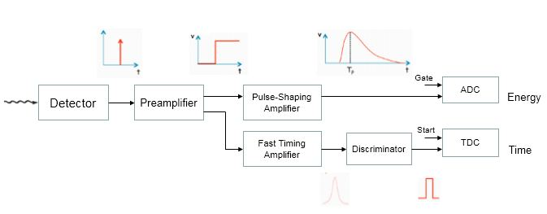

​	图 2-5-1 核探测器的能量路和时间路电子学

### 2.5.1 模拟信号和逻辑信号

​	根据携带信息的形式的不同，脉冲信号可分为模拟信号和数字信号或逻辑信号。模拟信号是指用连续变化的物理量表示的信息，其信号的幅度或频率随时间作连续变化。数字信号是指幅度的取值是离散的，幅度表示被限制在有限个数值以内，常用有限位的二进制数表示(如信号幅度高于设定幅值(高电平)表示二进制数1，否则表示二进制数0)。模拟信号容易受到噪声的干扰，造成信息损失。而数字信号只取决于高低电平，如果要造成信息传递的错误，那么信号的偏差必须至少达到高电平的一半左右。因此，逻辑信号对于噪声的抵御能力比模拟信号更强。探测器输出的模拟信号在电子学模块的某一部分开始转换成逻辑信号，然后一直以逻辑信号的形式传输和处理。

### 2.5.2 快信号和慢信号

​	快信号一般指上升时间小于几个 $ns$ 的信号，而慢信号通常指上升时间大于几百 $ns$ 的信号。快信号对时间测量和高计数率的应用十分重要。信号的快上升时间特性易受电路的寄生电容、电感等因素、不同电子学之间的阻抗匹配以及传输线的影响，因此在电子学设计以及信号的传输方面要注意保持信号的快的上升时间。而慢信号更适合于脉冲高度或能量的测量，因慢信号不易受噪声和上述因素的影响，在电子学和信号传输方面要求不是很严格。

### 2.5.3 信号的频谱和插件的带宽

​	描述一个信号的变化通常有时域和频域两种方法。在时域描述中信号的变量为时间，主要反映信号的幅度随时间变化的特征。信号的频域变量是频率，反映信号的频率结构以及频率与该频率信号幅度的关系。傅立叶分析理论表明，任何时域信号$f(t)$都可以分解成若干频率分量（称为谐波）的叠加。

$$f(t)=\frac{1}{2\pi}\int_{-\infty}^{+\infty}F(\omega)e^{j\omega t}dt \quad \tag{2-5-1}$$

$$F(\omega)=\int_{-\infty}^{+\infty}f(t)e^{-j\omega t}dt \quad \tag{2-5-2}$$

其中$F(\omega)$称为$f(t)$的傅里叶傅里叶变换，$f(t)$称为$F(\omega)$的逆傅里叶变换，两者之前存在一一对应关系。图 2-5-2显示了时域矩形脉冲信号( 图 2-5-2.a )以及对应的频谱( 图 2-5-2.b)。高频谐波构成波形中快速变化的部分(信号的上升沿)；低频谐波构成波形中缓慢变化的部分(信号的平坦部分)。

​	图 2-5-2 矩形脉冲信号（a) 时域, (b) 频谱

频率响应 简称频响，在电子学上用来描述一台仪器对于不同频率的信号的处理能力的差异。对于任何实际的仪器而言其频率响应都限制在一定的范围，这个范围用带宽来描述。当仪器输入正弦波时，输出波的幅值衰减到输入波约70.7%(-3dB)所对应的频率称为带宽(图 2-5-3)。

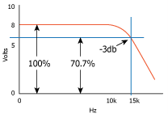

​	图 2-5-3 仪器的频率响应

对于处理快信号的电子学必须要有与信号的上升时间相匹配的带宽，核电子学中快电子学的带宽通常要求高于$500MHz$。

### 2.5.4 输入阻抗和输出阻抗

在具有电阻、电感和电容的电路里，对电路中的电流所起的阻碍作用叫做阻抗。阻抗用符号$Z$表示，其数值等于电路两端的电压有效值$V$和输入电流有效值$I$的比值，即$Z=V/I$。它的值由交流电的频率、电阻R、电感
L、电容C相互作用来决定。一个具体的电路其阻抗是随时变化的，它会随着电流频率的改变而改变。

输入阻抗是指一个设备输入端测得的阻抗$Z_{in}=V_{in}/I_{in}$; 输出阻抗是在设备的输出端测得的阻抗$Z_{out}=V_{out}/I_{out}$，可看成设备的内阻(图 2-5-4)。

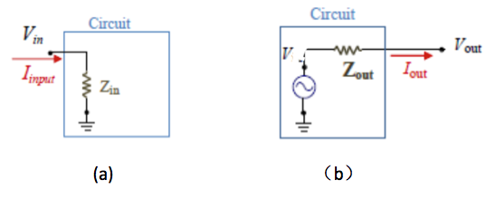

​	图 2-5-4 (a) 输入阻抗 （b）输出阻抗

考察负载对一设备的输出幅度的影响时，设备可等效成一个理想电压源V与输出阻抗$Z_{out}$串联的模型。当设备不连接负载时输出幅度为$V_{out}=V$, 而将其输出端接到输入阻抗为$Z_{in}$的其他设备输入端时(图2-5-5)，$V_{out}=V/[1+(Z_{out}/Z_{in})]$。由此可见，前一级输出阻抗$Z_{out}$越小，下一级输入阻抗$Z_{in}$越大，则传到下一级设备的幅度$V_{out}$越大。因此，对于处理能量(幅度)信号的设备而言，为使负载不改变输出信号的大小，在设备之间连接时中要求$Z_{out} \ll Z_{in}$。而对于处理快信号的电子学而言，则要求$Z_{in}=Z_{out}$，以避免阻抗不匹配引起的信号的反射(详见实验1.同轴电缆部分)。

​	图 2-5-5 设备连接负载时输出信号幅度的变化 

​	由于处理能量信号和时间信号的电子学在互相连接时前后级的阻抗配合要求不同，因此$NIM$标准将核电子学系统分成了快电子学和慢电子学两部分，这两部分在设计和互联中分别强调保持幅度和时间特征。

### 2.5.5 NIM 标准

NIM （Nuclear Instrument Module） 标准是最早提出的核电子学插件化的标准。  NIM标准包括仪器箱体插件的基本结构、尺寸、供电电压、联接方式、信号的输入输出等项标准。 NIM标准的确立大大提高了核电子学仪器的机械互换性和电气互换性。其主要内容有: 采用19英寸箱体、插件标称高度221.5毫米、深245.7毫米、单位宽度34.3毫米。每个箱体中可容纳12个单宽插件，或其他倍宽插件的组合。供电电压规定为±24伏、±12伏、±6伏插件与箱体通过标准的 42芯针式插接件相连接( 图 2-5-6 )。

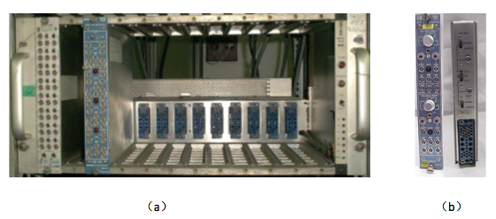

​							图 2-5-6 (a). NIM 机箱 	(b).NIM插件

NIM快逻辑信号的输入阻抗和输出阻抗均为50$\Omega$，标准电平是－0.8V 时为逻辑 "1", 电平为 0V 时为逻辑 "0"，脉冲信号的上升和下降时间小于4$ns$ ( 图 2-5-7)。由于信号的快的上升时间，在快逻辑信号的处理中必须保持阻抗匹配(包括电缆)，以避免信号反射。NIM快逻辑信号用于时间信号的处理，脉冲的前沿的代表时间信息，脉冲的宽度要求小于脉冲的重复时间。

​								图 2-5-7 NIM 快逻辑信号

###2.5.6 前置放大器
大多数的核探测器直接输出信号的幅度都很小，如Si探测器的直接输出信号小于1mV。因此信号在传输过程中容易受到噪声的干扰，不利于远距离传输。另外一般来说，核探测器的内部阻抗远大于下一级电子学(如主放大器)的输入阻抗，因此如果探测器和下一级电子学直接连接(并联)，大部分电流信号会消耗在探测器内部，不利于将信号传到下一级。前置放大器(简称前放)位于探测器和下一级电子学之间，将探测器的输出信号进行放大，提高信噪比，并提供探测器和下一级电子学之间的阻抗匹配，提高探测器输出信号传输到下一级的比例。实际应用中前置放大器应尽可能靠近探测器，减少探测器和前置放大器之间信号传输电缆的长度。

前置放大器可分为电流灵敏、电压灵敏和电荷灵敏三种类型。

电流灵敏前置放大器保持探测器输出的电流信号的快时间特性，用于时间型和高计数率测量的核探测器，如闪烁体+光电倍增管等。

电压灵敏前置放大器的结构如图 2-5-8.a所示，输出信号幅度V与探测器上电荷量Q满足，

$$V=-\frac{R_1}{R_2}\cdot\frac{Q}{C}    \tag{2-5-3}$$

其中C为探测器电容。V与探测器电荷量 $Q$ 成正比, 可用于能量型的核探测器。该类型的前置放大器的输出电压幅度与探测器的电容有关，而电容的不稳定会导致输出电压的不稳定。

电荷灵敏放大器 (图 2-5-8.b)主要由有运算放大器和并联的反馈电容 $C_f$和反馈电阻 $R_f$组成。前置放大器的输出电压$V$与探测器的电容近似无关，只取决于反馈电容$C_f$的大小:   

$$V\approx -\frac{Q}{C_f}     \tag{2-5-4}$$

电荷灵敏前置放大器的放大倍数与探测器的电容的变化近似无关，广泛用于半导体和闪烁体等探测器，是目前高分辨能谱测量中用的最多的前置放大器。 

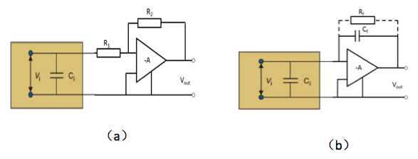

​	图 2-5-8 前置放大器电路示意图，(a). 电压灵敏前置放大器，(b). 电荷灵敏前置放大器

电路中$R_f$ 起到释放电容$C_f$上积累电荷的作用。脉冲的下降时间由取决于时间常数 $\tau=R_fC_f$。为了避免信号幅度的亏损，提高输出信号幅度，能量型前置放大器通常取较大的电路常数，$\tau$取几十到几百$\mu s$。

​	实际的前置放大器通常还有高压输入端，通过高压输入端施加探测器的工作高压，高压和前置放大器电路之间通过耦合电容彼此隔离。

###2.5.7 主放大器

一般来说前置放大器的输出信号还不能直接用于提取能量信息，其原因主要有以下两点：

1）前置放大器输出信号的信噪比还不是很理想，需要进一步改善。

2）当探测器中入射粒子的时间间隔小于前置放大器输出信号的宽度时，输出信号会产生堆积，即后一个信号会叠加在前一个信号的尾沿上，此时后一信号的幅度信息产生失真(图 2-3-9.a)。

图 2-5-9 (a) 前置放大器输出波形 (b) 主放大器输出波形

主放大器(也称谱放大器，简称主放)的电路示意图如 图2-5-10 所示，前置放大器输出阶跃信号经 $CR$微分电路和$RC$积分电路整形成准高斯形状。微分电路和积分电路通常采取相同的时间常数$\tau$,   $\tau$称之为主放的**成形时间**。后续的几级RC电路主要改善信号形状的对称性，并减少信号脉冲的持续时间。主放大器将输入信号整形成准高斯形状，显著改善信噪比，并显著减少信号的持续时间，减少信号的堆积。经主放处理后前放的堆积信号的幅度信息得到了恢复。(如图图 2-5-9.b)

​	图 2-5-10 主放大器电路示意图

实际的主放除了成形时间的调节外还具有防堆积，基线恢复等其他调节功能。

###2.5.7 时间甄别器
时间甄别器接收来自探测器或放大器的信号脉冲，产生一个与输入脉冲时间有确定关系的输出脉冲，这个脉冲称为定时脉冲，输出脉冲的上升沿对应于脉冲的到达时间。常用的定时方法有前沿定时法和恒比定时法。

**前沿定时法**

前沿定时是拾取定时信号的最简单的方法，脉冲信号直接触发一个阈值固定的触发电路，在脉冲的前沿上升到超过阈值的时刻产生输出脉冲作为定时信号。

​	图 2-5-11 前沿定时法

为避免噪声信号触发定时电路，阈值应大于噪声信号的幅度。当信号脉冲的幅度变化时，定时点位置会发生相应的移动(如图 2-5-11), 称为时间游动(time walk)。

**恒比定时法**

恒比定时方法将输入脉冲分成两路(图 2-5-12.a)，一路将脉冲衰减为$f$倍 $(0<1<f)$  ；另一路将脉冲幅度倒向，并延迟$t_d$时间。两路信号经加法电路相加形成双极性信号(图 2-5-12.b )。

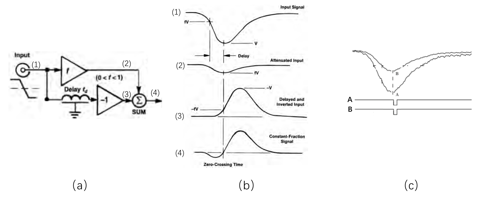

​	图 2-5-12 恒比定时法

可证明，对上升时间$t_r$的幅度随时间变化为线性的信号，当延迟时间满足$t_d>t_r(1-f)$时，双极性信号的过零点时间$t_{cross}$与输入信号幅度无关(图 2-5-12.c)。

$$t_{cross}=ft_r+t_d  \tag{2-5-5}$$

实际恒比定时甄别还有阈值调节，以避免小幅度的噪声信号触发定时电路。

前沿甄别定时应用于信号脉冲的幅度和上升时间变化不大，或时间分辨的要求不是很高的情形。恒比定时甄别对于信号幅度变化而信号形状(上升时间)不变化时有着广泛的应用，如闪烁体探测器、硅探测器等。

###2.5.8 符合方法

核物理中有许多同时发生或在短时间间隔内发生的相关事件，如$\gamma$射线的电子对效应中正电子和负电子总是同时产生，这种两个或两个以上同时产生的事件称为符合事件。在实验测量中, 除了所要研究的物理过程外，还有很多其他过程产生的粒子对待测物理过程形成干扰，如$\gamma$射线电子对效应测量中，由原子核的$\beta$衰变产生的负电子的本底。符合方法利用电子学的方法在不同探测器的输出脉冲中把符合事件选择出来。符合电路有两个或两个以上的输入信号，当这些脉冲上时间上有重叠时输出符合信号 ; 反符合电路则在一路有输入信号而其他路没有输入信号时输出信号(图2-5-13)。利用多个探测器的符合和反符合信号的组合，可以在复杂的背景事件中选取特定的物理过程。

图 2-5-13 A,B两路信号的符合，其中 A**B为符合信号，$A$* *$\overline B$ 为反符合信号

(a). 两个脉冲有符合，(b). 两个脉冲没有符合

###2.6 数据获取系统

​	在核物理实验研究中通常由多种不同类型的探测器组成一个实验装置，利用前端电子学将探测器脉冲信号转换成幅度和时间等信号。数据获取系统利用ADC或TDC等模拟-数字转换插件将前端电子学信息进行数字化后进行存储，供日后进行分析。数据获取系统一般由触发逻辑，获取总线和插件，计算机以及获取软件构成(图 2-6-1)。插件又分为一般功能组件(如ADC, TDC等)和机箱控制器。机箱控制器用来控制机箱内各插件的动作并提供机箱与外部计算机之间的通讯接口功能。 

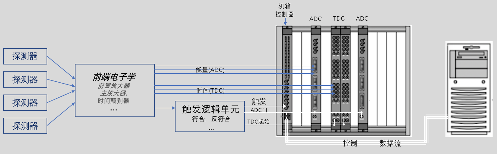

图 2-6-1 获取系统示意图

#### 触发

​	在实际的核物理实验中，感兴趣事例通常只占所有事件数的很少一部分。如在两个HPGe探测器测量$^{60}Co$放射源的$\gamma$射线实验中，两个能量为1.17 MeV和1.33 MeV的级联$\gamma-\gamma$事件的数目不到所有探测器测到的$\gamma$射线的事件数目的万分之一。为了更多地获取感兴趣的事件，并尽可能排除其他无关事件，数据在进行储存之前要经过判选，只使那些满足一定条件的事例去触发获取系统，将这些事件转换成数字信号并存储到计算机。通过设置不同探测器信号之间的符合或反符合，可选出特定的事例作为获取系统的触发信号。触发信号进行适当的展宽和延迟后作为ADC的门信号或TDC的起始时间信号(见下节 ADC和TDC)。上述例子中将两个探测器的符合信号作为获取系统的触发，可用于记录两个$\gamma$射线的关联事件。

 #### ADC 和 TDC

ADC(Analog-to-Digital Converters)测量模拟信号的幅度，并将其转换成数字。ADC在ADC门(ADC gate)信号脉冲持续期间，寻找电压脉冲的高度的最大值，并将其转换成对应的数字信号进行记录(图2-6-2)。 ADC将输入信号幅度范围$0-V$分成$N$个相等的区间，当脉冲高度$v$在幅度区间 $nV/N \le v \lt(n+1)V/N$时 ADC记录数字n, n称为道值(channel)。以常用12位ADC为例，该ADC将输入信号0-4V分成12位，即$2^{12}$=4096个区间，每1mV的幅度大致等于一道。

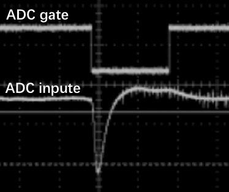

图 2-6-2 ADC的门与输入信号

TDC(Time-to-Digital Converters)则先将探测器时间信号的时刻$t$ 相对于TDC起始(TDC start)信号脉冲的时间差$\Delta t=t-t_0$转换成电压幅度信号，再将其幅度值转换成对应的道值。12位 250ns时间范围的TDC为例，每一道对应250ns/4096 ~60ps的时间间隔。

ADC和TDC在进行模数转换所需的时间称为转换时间，这段期间插件将不接受其他新的转换请求。现代ADC和TDC的转换时间一般小于$10\mu s$。ADC(TDC)每道对应的能量(时间间隔)可通过测量已知能量(时间间隔)的信号刻度得到，具体步骤详见实验xx,xx。

 #### 获取总线

数据获取系统的前端总线将各种功能的插件插在标准机箱中，通过数据总线实现插件的连接和通信。前端总线标准经历了CAMAC、VME等发展过程。CAMAC系统具有24位的数据总线，较慢的数据传输率(3MB/S)。CAMAC系统因应用早、应用广泛,现仍拥有大量用户。VME系统具有32位/64位系统总线，很高的数据传输率(80MB/s)。VME系统正逐步替代CAMAC系统得到越来越多的应用,尤其是应用在大型的数据获取系统中。 插件的转换时间，从前端获取总线到计算机的数据传输所需时间，获取软件的处理时间共同构成获取系统的死时间。

#### 获取软件

获取软件提供对获取进程的控制，数据的存储，在线显示，离线显示等功能。

##2.7 数字化电子学简介
前述的核电子学处理的是模拟信号(连续时间信号)，而数字化电子学将模拟信号转变成离散时间信号进行处理。数字化电子学作为一门新兴技术手段，得益于计算机学科及信息科学的飞速发展，在核物理领域中发挥着日益重要的作用。数字化电子学的信号处理流程，如图2-7-1所示。

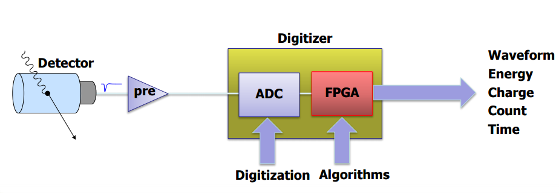

图 2-7-1 数字化电子学信号处理流程

经前放处理放大后的探测器信号，送入数字化电子学后首先利用ADC将其按照一定的采样间隔$T_s$( $f_s = 1/T_s$，$f_s$ 表示采样频率)采样。每次采样通过把模拟信号幅值和ADC内部的 $2^{bit}$(bit 表示采样的精度)比较器对比并转换成数值，其数值序列就代表了所要采集的波形，如图 2-7-2。

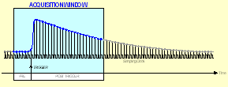

图 2-7-2 模拟信号的数字化

### 采样定理

在数字信号处理领域中，采样定理是模拟信号和数字信号之间的基本桥梁，是连续信号离散化的基本依据。以频率为$f$的连续正弦信号为例，当以低于$f$的采样频率对其进行采样时，采样后的数据点的频率不符合原信号的频率，产生失真，这个现象叫做"混叠"(aliasing)（图 2-7-3）。采样定理指出，在进行模拟-数字信号的转换过程中，当采样频率$f_{s}$大于信号中最高频率$f_{max}$的2倍时($f_{s}>2f_{max}$)，数字信号将完整地保留原始信号中所有信息。实际应用中信号通常具有很宽的频谱, 而采样的频率$f_s$是固定的。为了避免产生混叠，数字化设备在A/D转换之前通过低通滤波器将信号的带宽BW限制在$BW<f_s/2$。

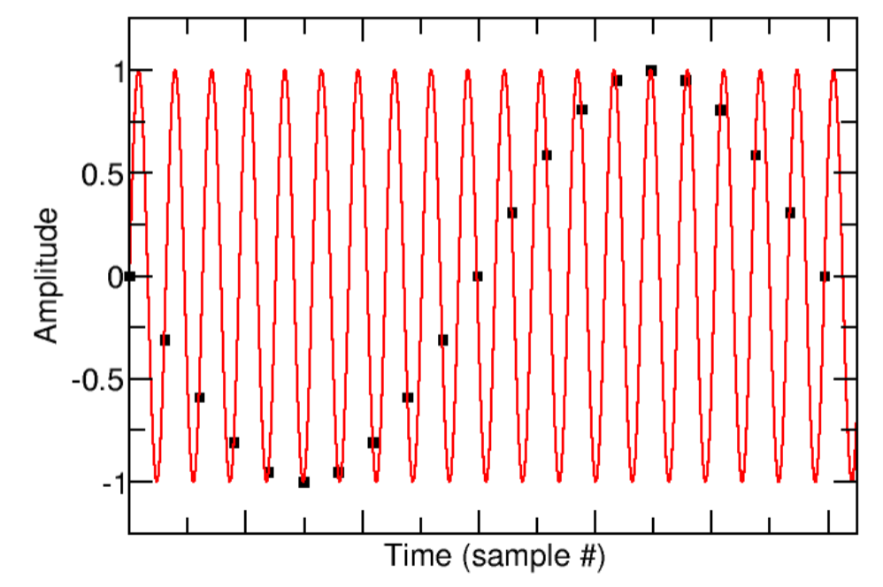

图 2-7-3 频率为$f$的连续的正旋波信号以频率$f_s(f_s<2f)$进行采样时产生的混叠现象

###数字化算法

数字信号波形在可编程逻辑单元FPGA内部，利用内置的各种数字化算法实时进行信号处理。每种数字化算法与传统的主放大器，时间甄别器等特定功能的模拟插件相对应。经数字化算法计算后，将提取的能量、时间、和脉冲形状信息传到电脑进行分析。数字化电子学的核心是FPGA的内置算法，算法可根据不同的需求进行改写。数字化算法本质上是相应模拟电子学的软件实现，但不受模拟电子学中电子元件性能的限制，因此在很多领域具有更加优良的性能。相比于模拟电子学，数字化电子学结构简单，具有很高的灵活性：可通过数值化算法同时进行能量、时间、和脉冲形状相关信息的提取。一旦波形被数字化，后续信号处理不会引入不必要的噪声问题，对环境的要求也更加宽泛。当前数字化电子学技术在核物理测量方面得到了广泛的应用，并在很多方面正在逐步取代模拟电子学。

### 参考文献

[1] 测试技术基础，王伯雄主编 清华大学出版社

[2]  William R. Leo, Techniques for Nuclear and Particle Physics Experiments, Springer-Verlag Berlin Heidelberg，1994.

