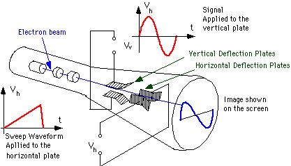
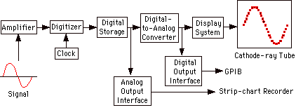
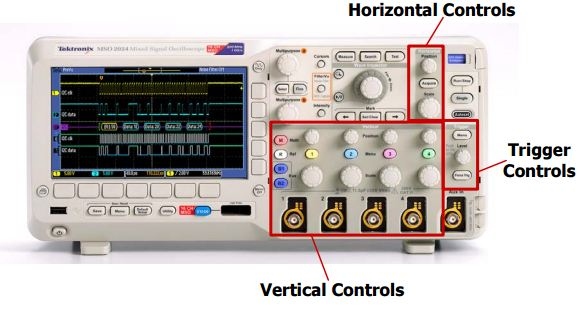
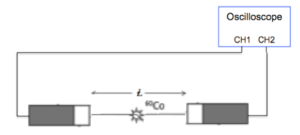

## 实验 1. 示波器使用
### 实验目的
 1. 了解示波器基本原理，熟悉示波器的使用方法
 2. 掌握观察不同特征的脉冲信号的方法

### 实验内容

1. 调节示波器的输入阻抗、触发模式、幅度范围、时间范围稳定显示周期方波信号。
2. 观察硅探测器和闪烁体探测器的输出信号，记录信号特征，并观察输入阻抗对信号的影响。
3. 观察两路塑料闪烁体探测器的符合信号。

### 示波器原理

示波器是绘制信号幅度随着时间的变化的波形显示仪器。根据采样方式的不同，示波器可分为模拟示波器和数字示波器。模拟示波器的工作原理如图 1-1 所示，示波器利用电子枪发射的一束聚焦电子束，在涂有荧光物质的显示屏形成光点。被测信号电压加到示波器的Y轴输入端，经垂直放大电路加于示波管的垂直偏转板。被测信号的大小以及极性决定电子束在Y方向的偏转距离。示波管水平偏转板上加的是锯齿波信号电压，驱动电子束在X方向匀速偏转，因此示波器的示波管的横轴相当于直角坐标的时间轴。经过一个锯齿波信号周期，电子束便在示波管的荧光屏上描绘出被观测信号的波形的一段轨迹。通常模拟示波器只能在屏幕屏荧光信号持续期间观察信号。

​								图 1-1 模拟示波器工作原理

数字示波器(图 1-2 )则按一定的时间间隔对信号电压进行采样，然后用模数转换器(ADC)将这些采样值转换成一系列的数字信号并将其储存起来，当累积到足够的采样点时在屏幕中绘制波形。与模拟示波器不同，数字示波器可以实现对信号波形进行长期存储并能利用机内微处理器系统对存储的信号做进一步的处理，例如对被测波形的频率、幅值、前后沿时间、平均值等参数的自动测量以及多种复杂的处理。

​								图 1-2 数字示波器工作原理

目前数字示波器已逐步取代模拟示波器成为主流选择，下面将以数字示波器为例介绍示波器的主要功能参数以及使用方法。

#### 1. 示波器主要参数
##### 带宽
示波器带宽体现了示波器能够准确测量的最大频率范围。对于上升很快的脉冲信号，当示波器没有足够的带宽时，信号中高频成分衰减严重，显示波形的上升沿变平缓，幅度失真。示波器上升时间$t_{r}$与所需示波器带宽$BW$之间的关系可用下式进行估计：

$$BW=0.35/t_{r}   \quad   \tag{1-1}$$
示波器测得的上升时间$t_{ro}$与实际输入信号上升时间$t_{rs}$之间满足如下关系：

$$t_{ro}^2=t_{rs}^2+t_{r}^2  \quad  \tag{1-2}$$

如$350 MHz$采样率的示波器($t_r=1ns$)测量上升时间$t_{rs}=1ns$的输入信号时，示波器测得的上升时间为$t_{ro}=1.41ns$。

##### 采样率
采样率指数字示波器每秒获取采样点的数目，单位是MS/s或GS/s。示波器采样率越高，分辨率及显示波形细节越高。为准确重建信号，示波器的采样率应大于信号最高频率成分的5倍。由于示波器只能存储有限的数量的采样点(称为存储深度或记录长度)，因此示波器采集时间长度与采样率成反比。

$$采集时间=记录长度/采样率  \quad \tag{1-3}$$

即示波器在改变水平方向时间标度(时基)后，采样率按公式1.1 变化，如时$100 ns/格$变成$1\mu s/格$时，示波器的采样率将变成原来的$1/10$。

#### 2. 触发

在时间域中观测信号可看成沿着时间轴幅度持续变化的序列，而示波器只能观测信号时间流中特定的一个时间范围。如果示波器多次观测的时间与被测信号没有稳定的时间关系，那么屏幕上的波形将杂乱无章(图1-3.a)。

触发是示波器主要特征之一，触发功能可将感兴趣的信号波形捕捉并将其稳定显示。当被测信号满足设定条件即触发条件时，示波器在屏幕上的指定位置即从触发点开始绘制信号(图 1-3.b)。触发功能通过重复显示输入信号的同一部分，使重复的波形稳定显示在显示屏上。为了稳定波形显示，示波器在产生触发后暂时将触发电路封闭一段时间（即释抑时间），在这段时间内，即使有满足触发条件的信号波形点示波器也不会触发。

​							图 1-3 (a)无触发时的正弦函数波形显示, (b)有触发时的正弦函数波形显示

 为方便观察特定信号之前发生的更多事件，示波器将触发点之前的信号也同时显示在屏幕上。
示波器提供边沿触发、条件触发、间隔触发等多种触发方式，边沿触发是最常用的触发方式，绝大多数的应用都只是用边沿触发来触发波形。边沿触发分成上升沿和下降沿触发。当被测信号的电平变化方向与设定相同(上升沿:幅度随时间变大；下降沿：幅度随时间变小)，其值变化到与触发电平相同时，示波器被触发并捕捉波形（图 1-4）。

​									图 1-4 边沿触发时的波形显示

 条件触发设置两个通道之间的关联触发，在观察不同探测器之间符合信号时非常有用。观察两路信号的关系时，两路设置各自的触发条件。当第二个波形满足触发条件一次时,在第一个波形的设定触发位置产生触发，并显示波形。图 1-5 的触发设置含义是：在CH1的上升沿达到触发电平200mV时，触发C1，但前提是CH2的电平曾超过了200mV。

​									图 1-5 条件触发时的波形显示

#### 3. 示波器控制功能

示波器面板上按钮按照控制功能分成输入控制、垂直控制、水平控制、触发控制等部分 (图 1-6)。

​						 	        图 1-6 示波器控制功能

##### 输入控制

输入控制设置输入信号与示波器的耦合模式，主要有输入耦合和输入阻抗两部分，可对每个输入信号单独进行设置。
1. 输入耦合 
   输入耦合可以设置成DC(直流)、AC(交流)和GND(地)。DC耦合为输入信号提供直接的连接通路，因此信号的所有分量(直流和交流)都会影响示波器的波形显示。AC耦合则在内部用电容过滤掉信号的直流电平，因此可以看到以零伏为中心的波形。当切换到GND档时，输入信号连至示波器的地电平，屏幕上显示一条显示位于0伏电平的直线。
2. 输入阻抗
   为了准确测量输入信号并避免发生失真，信号源的输入阻抗和示波器的输入阻抗必须进行正确的匹配。当两者阻抗不匹配时信号会在信号源与示波器的接口上产生反射,从而产生振荡。带宽超过 200M 的示波器大多会有1MΩ和50Ω两种输入阻抗可供选择。

##### 垂直控制
 幅度调节：调整屏幕上每一个垂直网格表示的电压值（伏/格）。
 垂直位置控制：调整波形在屏幕垂直显示位置。
##### 水平控制
 时间调节：设置屏幕上每一个水平网格表示的时间范围。
 水平位置调节：可在屏幕左右移动波形。
##### 触发控制
常用的触发模式有自动触发(Auto)、正常触发(Normal)、单次触发(Single)等模式。
对于数字示波器，不论是否触发示波器实际上都是在不断地采集波形，但是只有稳定的触发才能有稳定的显示。当示波器触发电路的模式出于“Auto”模式时，不论是否满足触发条件都进行波形显示，并自动刷新。当信号满足触发条件时，在指定的位置显示波形，而当信号不符合触发条件时由示波器的定时器产生触发，在屏幕上显示波形。如果使用“Normal”模式，则只有满足触发条件时才在屏幕上显示，不满足触发条件则显示最后一次触发时的波形。 "Single"模式指仅捕获第一次满足触发条件的波形，捕获后就停止，并显示第一个满足触发条件时的波形。

触发电平: 设置触发电平的大小 。

### 实验装置

1. 采样率$\ge$ $1GS/s$, 带宽 $\ge$ $250MHz$ 的数字示波器一台
2. 周期方波脉冲发生器，频率在1kHz-1MHz内可调。 
3. $^{241}Am\ \alpha$-放射源一枚， 金硅面垒探测器(前置放大器)一套。
4. $^{60}Co\ \gamma$-放射源一枚， 塑料闪烁体探测器(PMT)两套。

### 实验步骤
#### 熟悉示波器面板和控制功能

1. 打开示波器电源，观察示波器启动过程。启动完毕后示波器屏幕显示设备状态的诊断结果。按屏幕左下方"Menu off"按钮，清除诊断信息。
2. 按CH1的按钮，观察屏幕上出现的输入耦合，输入阻抗等选项，尝试改变缺省的设置参数。
3. 按Trigger按钮，观察屏幕上出现的trigger模式选项。尝试改变触发电平位置以及触发模式选项。

#### 周期性信号观察
1.将脉冲发生器周期设置为1kHz,幅度设置为1V左右。CH1路接入脉冲发生器信号，调节时间量程为 $1ms/格$，幅度量程 $500mV/格$。
2.设置触发方式为边沿触发，触发模式为自动，触发电平 $-500mV$ 左右。观察屏幕上信号显示。依次改变示波器参数，观察信号变化并作出解释：改变输入耦合：DC/AC；改变输入阻抗： $50\Omega$ / $1M \Omega$；改变触发沿：上升沿/下降沿触发；改变触发模式："Auto"、“Normal”和“Single” 。
3.按“AutoSet”按钮观察信号显示，与步骤2观察信号进行对比。
#### 随机脉冲信号观察
1. 金硅面垒探测器信号接入CH1，调节示波器观察信号。
2. 将触发模式设置为自动，调节垂直方向量程，观察信号的基线位置。
3. 在基线电平上下改变触发电平观察信号，如果在示波器观察到水平位置相对稳定的信号，则意味着触发电平在信号幅度变化的范围以内。将示波器量程设置到合适的范围。
4. 调节时间量程,和水平移动观察完整的波形。改变边沿触发方式，得到上升沿稳定的显示信号。将边沿触发改成另一个选项，观察信号显示。判断何种触发方式正确，并说明理由。
5. 重复周期性信号观察部分的步骤2。
6. 记录波形特征：上升时间，下降时间，信号幅度偏置，信号幅度范围，信号重复频率。
7. 接入塑料闪烁体输出信号到CH1，重复步骤2-5。

#### 符合信号观察

​										图 1-7 符合信号观察

1. 按照图1-7将两个塑料闪烁体探测器放置于 $^{60}Co$放射源两侧，探测器信号分别接入CH1和CH2。
2. 设置CH1和CH2的示波器参数各自得到稳定的波形显示。
3. 触发方式设为边沿触发，触发模式设为"Auto"。将CH1设为触发源，观察CH1和CH2波形是否有符合。
4. 将触发模式设置为条件触发，观察CH1和CH2的符合。

### 思考题

1.实验中观察的两种类型的信号，示波器不同输入阻抗有着什么影响，如何选择正确的阻抗值？

2.CsI+PD探测器+前置放大器，前置放大器有-500mV的偏置电平。输出信号上升时间100ns，信号从峰顶以$100 \mu s$为时间常数下降，信号幅度为 $-5mV$~$-50mV$。试设置示波器的幅度、时间量程以及适合的触发模式。

### 参考资料

[1] http://info.tek.com/cn-xyzs-of-oscilloscopes-primer.html

