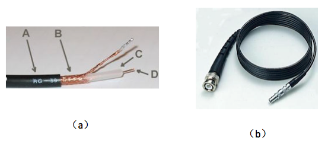
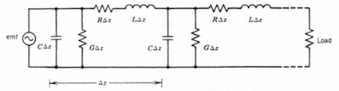
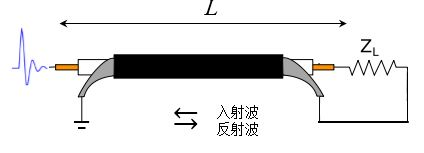
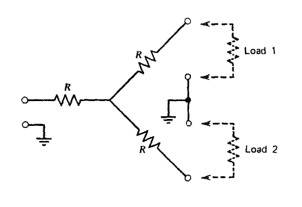

## 实验 2. 同轴电缆的信号传输

大多数核物理实验中探测器和电子学插件之间以及电子学插件之间的信号传输是通过传输线来实现的。作为电路的一部分，传输线的特性对信号产生不可忽略的影响。如果传输线与设备之间匹配不当，会使传输信号产生反射、畸变、衰减等损失，因此掌握传输线的特性以及与设备的正确匹配方法对于得到正确的实验结果具有重要的意义。核物理实验中常用的传输线是同轴电缆，在本实验中我们主要掌握同轴电缆的特性和用法。

### 实验目的

1. 了解同轴电缆的信号传输特征。
2. 掌握阻抗匹配与信号反射的关系。

### 实验内容

1. 用脉冲发生器和不同终端阻抗匹配的同轴电缆观察信号反射
2. 用反射信号测量信号在同轴电缆的传输速度
3. 电子学插件之间的阻抗匹配
4. 长同轴电缆对信号的衰减

### 实验原理

#### 1. 同轴电缆的信号传输

同轴电缆结构如图 2-1.a 所示，同轴电缆是内外由相互隔绝的同轴心导体构成的电缆，中心轴线是一条铜导线，外加一层绝缘材料，绝缘材料由网状铜丝包裹，整个电缆被绝缘的护套包住。中心导线用于传输信号，外部金属网除了作为信号公共地线为信号提供电流回路外，也起到屏蔽外部电磁场对中心导线的干扰的作用。在同轴电缆的两端接有连接器，常见的有$BNC$或$LEMO$ 标准的连接器(图 2-1.b )。

​									 图 2-1 同轴电缆

​											

同轴电缆的等效电路见图 2-2，信号沿着$z$方向传播。单位长度的同轴电缆的可等效为由C、G和R、L组成的T型网络，其中$R,L,C和G $分别为单位长度传输线的电阻，电感，电容和电导率。实际传输线可表示为无限多个T型网络的级联。

​									图 2-2 同轴电缆等效电路

设信号的频率为$\omega$,  对于理想的无损耗传输线，其$R=0,G=0$。则描述传输线上电压$V(z,t)$和电流$I(z,t)$之间关系的微分方程组可写为
$$\frac{dV(z,t)}{dz}=j\omega LI(z,t)  \quad   \tag{2-1}$$

$$\frac{dI(z,t)}{dz}=j\omega CV(z,t)   \quad  \tag{2-2}$$
其通解为

$$V(z,t)=V_1exp[j(\omega t-kz)]+V_2exp[j(\omega t+kz)]=V_i(z,t)+V_r(z,t)  \quad  \tag{2-3}$$

$$I(z,t)=\frac{V_1}{z_0}exp[j(\omega t-kz)]-\frac{V_2}{z_0}exp[j(\omega t+kz)]=I_i(z,t)+I_r(z,t)   \quad  \tag{2-4}$$

其中$z_0=\sqrt{\frac{L}{C}}$,   $k=\omega \sqrt{LC}$。

2-3 式中$V_i$的传播方向与入射波相同，$V_r$的传播方向与入射波相反，即前行入射波经同轴电缆传输出现反射波。

#### 2. 特征阻抗
传输线的特征阻抗定义为传输线上入射波电压$V_i(z,t)$与入射波电流$I_i(z,t)$之比,即

$$z_0=\frac{V_i}{I_i}=\sqrt{\frac{L}{C}}  \quad   \tag{2-5}$$

可看出在无损耗情况下，特征阻抗与电缆的长度和频率无关，只取决于本身的几何尺寸和材料的特性相关。对于实际的传输线$R\neq0$,$G\neq0$, 特征阻抗与频率相关，
$$z_0=\sqrt{\frac{R+j\omega L}{G+j\omega C}}  \quad   \tag{2-6}$$
当$\omega>100k Hz$时，上式可化为1.1式。注意特征阻抗的概念适用于交流或脉冲信号，不能用于直流信号。核物理实验中常用的同轴电缆特征阻抗为50$\Omega$。
####3. 信号传播速度
$$v=\frac{\omega}{k}=\frac{1}{\sqrt{LC}}   \quad \tag{2-7}$$
信号经过单位长度所需的时间或单位长度传输线引起的延迟时间为

$$T=v^{-1}=\sqrt{LC}   \quad  \tag{2-8}$$

对于特征阻抗为50$\Omega$的同轴电缆，1米传输线导致约5ns的时间延迟。

#### 4. 信号反射与阻抗匹配
 由 2-3 和 2-4 式可以看出，同轴电缆上电压和电流均由两个正方向传播的入射波和反方向传播的反射波合成，其比例由边界条件给定。当信号从源端经传输线传向终端，终端接有负载阻抗$Z_L$时，入射波与反射波的相对大小取决于传输线的特征阻抗$z_0$和负载阻抗$Z_L$的失配程度( 图 2-3)。

​									图 2-3 同轴电缆的终端阻抗匹配

定义反射系数$\rho=V_r/V_i$,则

$$\rho=\frac{Z_L-Z_0}{Z_L+Z_0}   \quad \tag{2-8}$$  

下面分三种常见情况讨论：

1. 当$Z_L < Z_0$，$\rho<0$,电压反射波与入射波极性相反。终端短路即$Z_L=0 $ 时，入射波和反射波大小相同极性相反( 图 2-4.a)。

2. 当$Z_L > Z_0 $，$\rho>0 $,电压反射波与入射波极性相同。终端开路即$Z_L=\infty$时，入射波和反射波大小相同极性相同( 图2-4.b)。

3. 当$Z_L=Z_0$，$\rho=0$,反射波幅度为零，称负载阻抗与同轴电缆阻抗是匹配的( 图 2-4.c)。

   

										图 2-4 同轴电缆的信号反射

在输入端观察信号时，入射信号与到达的反射信号的时间差为$\Delta t=2L/v$,其中$L$为传输线长度，这一特性可用于测量电缆的长度。
从信号的完整性考虑，负载的阻抗应与传输线的特征阻抗匹配，如果两者不匹配则在阻抗突变处产生反射信号，反射信号叠加在入射信号中，使信号产生失真。
在实践中对于慢信号(上升时间较长)，阻抗匹配的要求通常没有那么严格。一般来说如果反射信号时间差不大于信号的上升时间时，即$\Delta t<t_r$，则反射信号与入射信号在时间上有重叠，对待测信号不产生很大影响。此时可认为阻抗是匹配的。
如对于电荷灵敏前置放大器输出的能量信号 ($t_r\approx 几十ns$) 输入到主放大器 (输入阻抗$Z_{in}\approx 1K\Omega$) 时用不太长的50$\Omega$的同轴电缆不会对能量分辨产生显著的影响。而对于上升时间很短的快时间信号，则需要进行严格的阻抗匹配，这也是NIM标准中规定时间电子学插件的输入和输出阻抗均为50$\Omega$的原因。

#### 5. 同轴电缆的信号衰减

对于实际的传输线$R\neq0$,$G\neq0$, 同轴电缆传输方程的电压的通解为，

$$V(z,t)=V_1e^{-\alpha z}e^{j(\omega t-kz)}+V_2e^{\alpha z}e^{j(\omega t+kz)}  \quad \tag{2-9}$$

其中系数$  \alpha$和 $k$ 由 $\alpha +k=\sqrt{(R+j\omega L)(G+j\omega C) }$ 求出。

在$\omega>100k Hz$时, $\alpha$随频率$f=2\pi \omega$的关系可表示为，

$$\alpha(f)=a\sqrt{f}+bf  \quad  \tag{2-10}$$

其中a和b为与电缆特性相关的常数。$\alpha$称为电缆的衰减常数，$\alpha$的大小与频率相关，频率越大，$\alpha$越大。

考虑一宽度为$\Delta$, 幅度为1的方波，经不同长度为$x$的同轴电缆时信号的形状如图 2-5所示。

​								图 2-5 方波信号经不同长度电缆时信号的变化

图中 $\tau_0=\frac{{ax}^2}{\pi}$。从图中可以看出随着电缆长度的增加，输出信号幅度变小，其中信号的高频部分衰减大于低频部分，导致信号的快时间特征逐渐丧失。同轴电缆导致的信号幅度衰减与形状畸变是信号长距离传输中必须考虑的问题。

### 实验装置

1. 采样率$\ge$ $1GS/s$, 带宽 $\ge$ $250MHz$ 的数字示波器一台。
2. 脉冲发生器: 可产生标准方波，和衰减时间为$10ns$, $50\mu s$的周期脉冲。 
3. $0.5m$、$5m$、$10m$ ，20$m$同轴电缆若干。
4. $50 \Omega$ 匹配头，短接头，I型、T型连接器若干，$50\Omega$分路器一个。
5. 将输入阻抗为$50 \Omega$，$ 1K\Omega$的NIM插件各一路插入NIM机箱。

### 实验步骤
1. 打开示波器电源。调节脉冲发生器，产生衰减时间$\le$ 10ns的周期方波脉冲输出。设置示波器CH1和CH2路输入特性：输入阻抗$50\Omega$, DC耦合。示波器信号接入CH1,调节示波器幅度和时间量程以及触发模式得到稳定的信号显示。
2. 按图 2-6 连接脉冲发生器、同轴电缆到示波器。

​								图 2-6 同轴电缆在不同终端匹配实验图

依次连接5m，2m, 0.5m同轴电缆，改变终端匹配($50\Omega$匹配头、短接、断路)观察信号反射，记录反射信号与原始信号的时间差、反射信号与原始信号的幅度比值、并求出电缆传播速度。

3.按图 2-7 连接脉冲示波器、同轴电缆到示波器。

​							图 2-7 不同长度同轴电缆的传输信号实验图

依次连接20m，10m和1m的同轴电缆，观察ch2的信号形状，记录信号的延迟，幅度和形状。
4.信号输入改成衰减时间为$10ns$的周期脉冲，重复上述1-3步骤。

5.信号输入改成衰减时间为$50\mu s$的周期脉冲，重复上述1-3步骤。

6.打开NIM机箱电源，将同轴电缆一端连接到输入阻抗为$50 \Omega$，$ 1K\Omega$的NIM插件,重复上述步骤。

### 思考题
1.根据实验现象，总结出快信号和慢信号对阻抗匹配的要求。
2.信号传输距离变长时，脉冲形状(上升时间，下降时间，幅度等)，信号的噪声发生什么变化？

3.查资料研究当同轴线左端设备的输出阻抗或右端设备的输入阻抗远大于$50\Omega$时(如1$k\Omega$)，采取何种措施进行阻抗匹配？并进行实验验证。

### 附录

#### $50\Omega$分路器

在实验中经常会遇到将一路信号分成两路输出的需求。对于快信号不能直接用常见的三通连接器(或T型连接器)分路，而需要考虑阻抗匹配。$50\Omega$的阻抗匹配分路器可用三个 $16.6\Omega$ 的电阻组成的Y型网络实现, 此时当任意两端连接$50\Omega$负载后，另一端的输入阻抗变成$50\Omega$,如图所示。

### 参考文献

[1]  William R. Leo Techniques for Nuclear and Particle Physics Experiments, Springer-Verlag Berlin Heidelberg，1994

